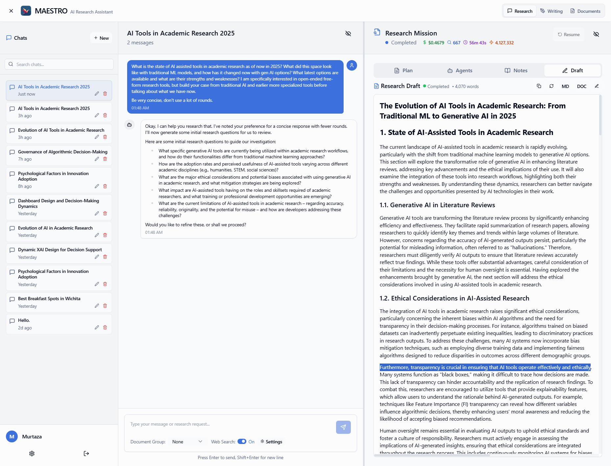
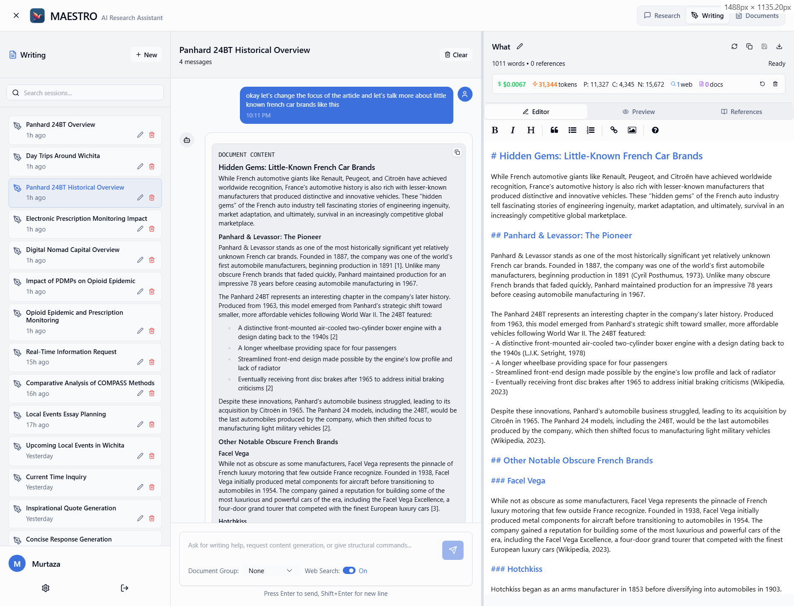
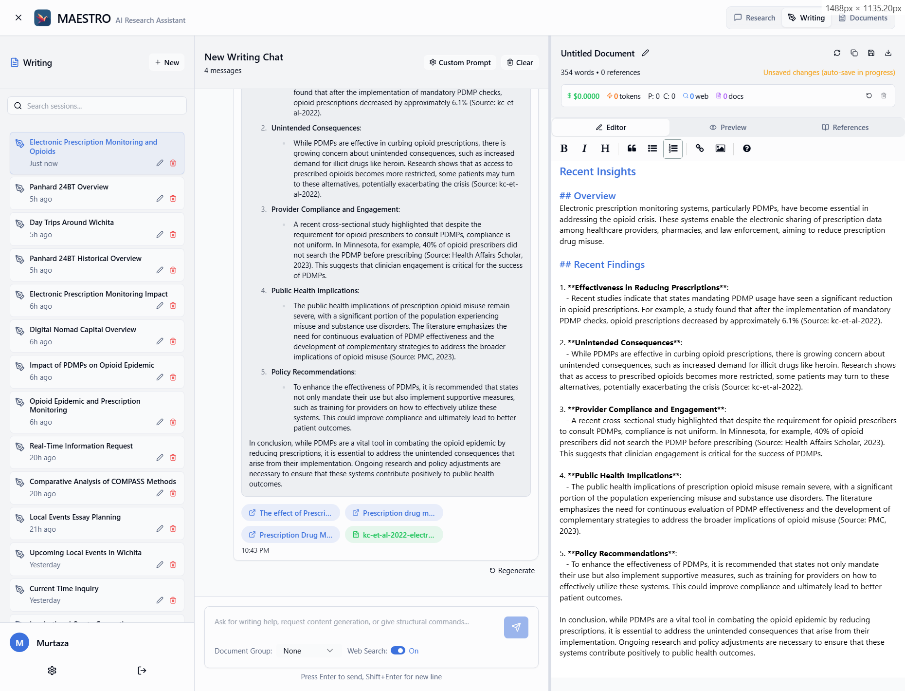
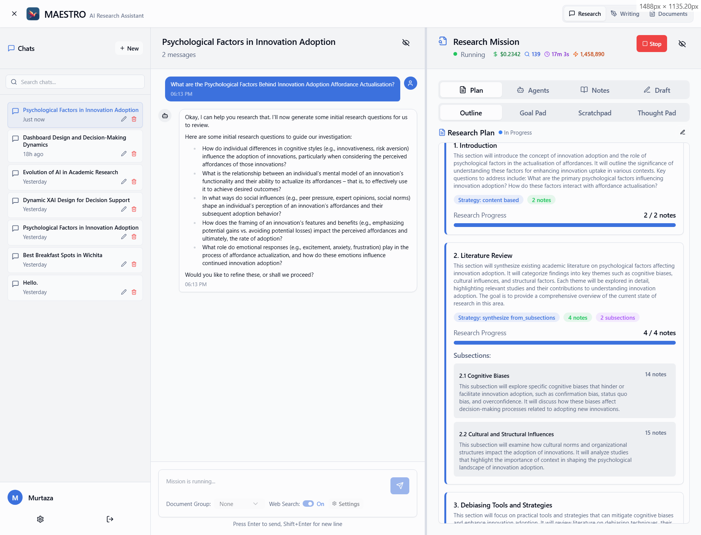
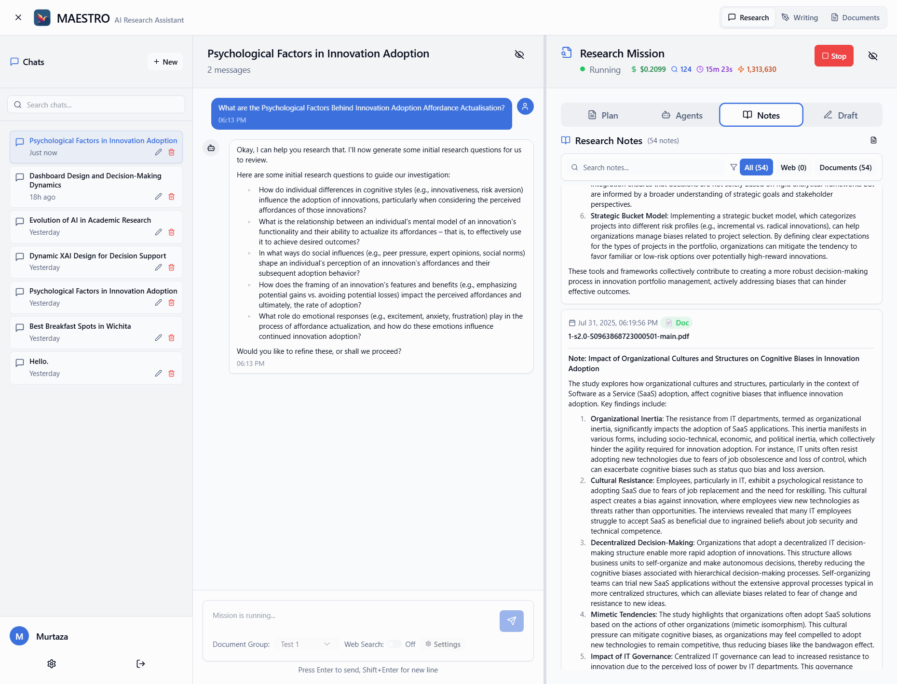
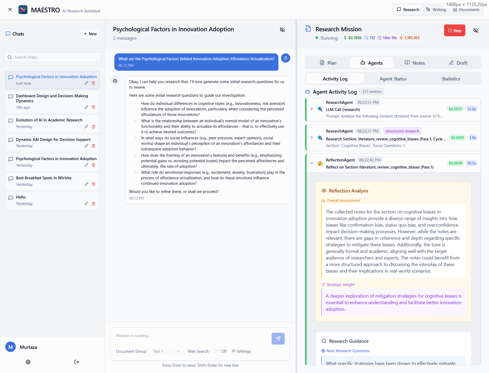
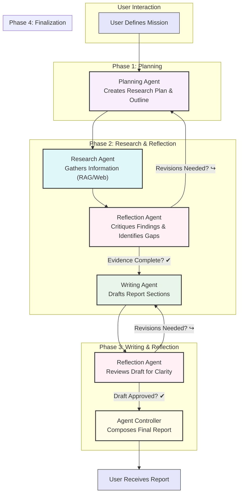

<p align="center">
  
</p>

# MAESTRO: Your Self-Hosted AI Research Assistant

[](https://www.gnu.org/licenses/agpl-3.0)

MAESTRO is an AI-powered research platform you can host on your own hardware. It's designed to manage complex research tasks from start to finish in a collaborative, multi-user environment. Plan your research, let AI agents carry it out, and watch as they generate detailed reports based on your documents and sources from the web.

<p align="center">
  
</p>

## A New Way to Conduct Research

MAESTRO streamlines the research process with a unified, chat-driven workflow. Define your research goals, upload your source materials, and let a team of AI agents handle the heavy lifting. It's a powerful tool for anyone who works with large amounts of information, from academics and analysts to writers and developers.

### Core Features

<details>
  <summary><strong>Manage Your Document Library</strong></summary>
  <br>
  <p>Upload and manage your PDF documents in a central library. MAESTRO's advanced Retrieval-Augmented Generation (RAG) pipeline is optimized for academic and technical papers, ensuring your AI agents have access to the right information.</p>
  <p align="center">
    
  </p>
</details>

<details>
  <summary><strong>Create Focused Document Groups</strong></summary>
  <br>
  <p>Organize your library by creating document groups for specific projects. This allows you to direct the AI to pull information from a curated set of sources, ensuring relevance and accuracy in its research.</p>
  <p align="center">
    
  </p>
</details>

<details>
  <summary><strong>Customize Your Research Mission</strong></summary>
  <br>
  <p>Fine-tune the research process by setting specific parameters for the mission. You can define the scope, depth, and focus of the AI's investigation to match your exact needs.</p>
  <p align="center">
    
  </p>
</details>

<details>
  <summary><strong>Chat with Your Documents and the Web</strong></summary>
  <br>
  <p>Use the chat interface to ask questions and get answers sourced directly from your documents or the internet. It's a powerful way to get quick insights or inspiration for your work.</p>
  <p align="center">
    
  </p>
</details>

<details>
  <summary><strong>Get Help from the Writing Assistant</strong></summary>
  <br>
  <p>The writing assistant works alongside you, ready to pull information from your library or the web to help you draft notes, summarize findings, or overcome writer's block.</p>
  <p align="center">
    
  </p>
</details>

<details>
  <summary><strong>Follow the Agent's Research Path</strong></summary>
  <br>
  <p>MAESTRO provides full transparency into the AI's process. You can see the research outline it develops and follow along as it explores different avenues of investigation.</p>
  <p align="center">
    
  </p>
</details>

<details>
  <summary><strong>Review AI-Generated Notes</strong></summary>
  <br>
  <p>Let the research agent dive into your PDF collection or find new sources online. It will then synthesize the information and generate structured notes based on your research questions.</p>
  <p align="center">
    
  </p>
</details>

<details>
  <summary><strong>Track Mission Progress in Detail</strong></summary>
  <br>
  <p>Keep a close eye on every step of the research mission. The system provides detailed, real-time tracking of agent activities and status updates.</p>
  <p align="center">
    
  </p>
</details>

<details>
  <summary><strong>Understand the Agent's Reasoning</strong></summary>
  <br>
  <p>The AI agents provide detailed reflection notes, giving you insight into their thought processes, the decisions they make, and the conclusions they draw from the data.</p>
  <p align="center">
    
  </p>
</details>

<details>
  <summary><strong>Get a Full Report with References</strong></summary>
  <br>
  <p>Based on the research plan and generated notes, a final draft will be generated, including references from your documents and internet sources.</p>
</details>

<details>
  <summary><h2>How It Works: The WRITER Agentic Framework</h2></summary>
  <br>

MAESTRO is a sophisticated multi-agent system designed to automate complex research synthesis. Instead of a single AI model, MAESTRO employs a team of specialized AI agents that collaborate to plan, execute, critique, and write research reports.

This methodology ensures a structured, transparent, and rigorous process from the initial question to the final, evidence-based report.

<p align="center">
  <em>The MAESTRO Research Lifecycle</em>
</p>
<p align="center">


</p>

### The Core Agent Team

MAESTRO's capabilities are driven by a team of specialized agents, each with a distinct role:

*   **Agent Controller (The Orchestrator):** Manages the entire mission, delegating tasks to the appropriate agents and ensuring the workflow progresses smoothly from one phase to the next.
*   **Planning Agent (The Strategist):** Takes the user's initial request and transforms it into a structured, hierarchical research plan and a report outline. This creates a clear roadmap for the mission.
*   **Research Agent (The Investigator):** Executes the research plan by gathering information. It uses its tools—the local RAG pipeline and web search—to find relevant evidence and organizes it into structured `ResearchNote` objects.
*   **Reflection Agent (The Critical Reviewer):** This is the key to MAESTRO's analytical depth. The Reflection Agent constantly reviews the work of other agents, identifying knowledge gaps, inconsistencies, or deviations from the plan. Its feedback drives the iterative loops that refine and improve the quality of the research.
*   **Writing Agent (The Synthesizer):** Takes the curated research notes and weaves them into a coherent, well-structured narrative that follows the report outline.

### The Research Process: Iteration and Refinement

The research process is not linear; it's a series of iterative loops designed to simulate critical thinking and ensure a high-quality outcome.

1.  **The Research-Reflection Loop:**
    The `Research Agent` doesn't just gather information in one pass. After an initial round of research, the `Reflection Agent` steps in to critique the findings. It asks questions like:
    *   *Are there gaps in the evidence?*
    *   *Do sources contradict each other?*
    *   *Have new, unexpected themes emerged?*
    Based on this critique, the `Reflection Agent` can recommend new research tasks or even prompt the `Planning Agent` to revise the entire plan. This loop continues until the evidence is comprehensive and robust. The number of iterations is dynamic and depends on the complexity of the topic.

2.  **The Writing-Reflection Loop:**
    Drafting is also an iterative process. Once the `Writing Agent` produces a section of the report, the `Reflection Agent` reviews it for:
    *   **Clarity and Coherence:** Is the argument easy to follow?
    *   **Logical Flow:** Are the ideas connected logically?
    *   **Fidelity to Sources:** Does the writing accurately represent the evidence in the `ResearchNote`s?
    The `Writing Agent` then revises the draft based on this feedback. This loop repeats until the writing meets the required standard of quality and accuracy.

This structured, reflective, and iterative process allows MAESTRO to move beyond simple information aggregation and produce sophisticated, reliable, and auditable research syntheses.
</details>

## Getting Started

MAESTRO is designed to be run as a containerized application using Docker.

### Prerequisites
*   **Docker** and **Docker Compose**
*   **Git** for cloning the repository
*   **Disk Space**: ~5GB for AI models (downloaded automatically on first run)

#### Hardware Requirements
*   **Recommended**: NVIDIA GPU with CUDA support for optimal performance
*   **Minimum**: CPU-only operation is supported on all platforms
*   **Platform Support**: 
    - **Linux**: Full GPU support with nvidia-container-toolkit
    - **macOS**: CPU mode (optimized for Apple Silicon and Intel)
    - **Windows**: GPU support via WSL2

### Installation

#### Linux/macOS
1.  **Clone the Repository**
    ```bash
    git clone https://github.com/murtaza-nasir/maestro.git
    cd maestro
    ```

2.  **Configure Your Environment**
    Run the interactive setup script for a guided configuration:
    ```bash
    ./setup-env.sh
    ```
    This will help you set up network settings, API keys, and other essential parameters by creating a `.env` file for you.

3.  **Build and Run**
    Use the automatic start script for optimal platform detection:
    ```bash
    # Recommended: Automatic GPU detection and optimal configuration
    ./start.sh
    
    # Alternative: Manual Docker Compose
    docker compose up --build -d
    ```

#### Windows
1.  **Clone the Repository**
    ```powershell
    git clone https://github.com/murtaza-nasir/maestro.git
    cd maestro
    ```

2.  **Configure Your Environment**
    Run the interactive setup script for a guided configuration:
    ```powershell
    # Using PowerShell (recommended)
    .\setup-env.ps1
    
    # Or using Command Prompt
    setup-env.bat
    ```
    This will help you set up network settings, API keys, and other essential parameters by creating a `.env` file for you.

3.  **Build and Run**
    Use the automatic start script for optimal platform detection:
    ```powershell
    # Recommended: Automatic GPU detection and optimal configuration
    .\start.sh
    
    # Alternative: Manual Docker Compose
    docker compose up --build -d
    ```

#### Access MAESTRO
Once the containers are running, access the web interface at the address you configured (e.g., `http://localhost:3030`). The first-time login credentials are `admin` / `adminpass123`. It is highly recommended that you change this password immediately.

### GPU Support and Performance Optimization

MAESTRO includes automatic GPU detection and configuration for optimal performance across different platforms.

#### Quick Start with GPU Detection
```bash
# Linux/macOS: Automatic platform detection
./start.sh

# Windows: PowerShell
.\start.sh

# Stop services
./stop.sh  # or .\stop.sh on Windows
```

#### Platform-Specific GPU Support

**Linux with NVIDIA GPU:**
- ✅ Full GPU acceleration with automatic detection
- ✅ Multi-GPU support with load distribution
- **Requirements**: `nvidia-container-toolkit` installed
- **Setup**: GPU support is automatically enabled when detected

**macOS (Apple Silicon & Intel):**
- ✅ CPU-optimized performance (no GPU runtime needed)
- ✅ Optimized for both Apple Silicon and Intel Macs
- ✅ Full compatibility through Docker Desktop

**Windows with WSL2:**
- ✅ GPU support through WSL2 and nvidia-container-toolkit
- ✅ Compatible with NVIDIA GPUs
- **Requirements**: WSL2 with GPU support enabled

#### Manual GPU Configuration

For advanced users, you can manually configure GPU settings in `.env`:
```env
# GPU device assignment (0, 1, 2, etc.)
BACKEND_GPU_DEVICE=0
DOC_PROCESSOR_GPU_DEVICE=0
CLI_GPU_DEVICE=0
GPU_AVAILABLE=true
```

#### Performance Tips
- **Multi-GPU**: Assign different services to different GPUs
- **CPU Mode**: Still performant for development and smaller workloads  
- **Memory**: Monitor GPU memory with `nvidia-smi`

#### Troubleshooting GPU Issues
```bash
# Check GPU detection
./detect_gpu.sh

# Test GPU in Docker
docker run --rm --gpus all nvidia/cuda:11.0-base nvidia-smi

# View service logs
docker-compose logs backend
```

> **Windows Users**: For detailed Windows setup instructions, troubleshooting, and CLI usage, see [WINDOWS_SETUP.md](./WINDOWS_SETUP.md).

## Database Management Tools

<details>
  <summary><strong>Database Reset and Consistency Tools</strong></summary>
  <br>
  
  MAESTRO uses a dual-database architecture that requires synchronized maintenance. The system includes powerful CLI tools for database management and consistency checking.

  ### Quick Database Operations
  ```bash
  # Check database status and consistency
  ./maestro-cli.sh reset-db --check
  
  # Get database statistics  
  ./maestro-cli.sh reset-db --stats
  
  # Reset all databases (with backup)
  ./maestro-cli.sh reset-db --backup
  ```

  ### Document Consistency Management
  ```bash
  # Check system-wide document consistency
  python maestro_backend/cli_document_consistency.py system-status
  
  # Clean up orphaned documents
  python maestro_backend/cli_document_consistency.py cleanup-all
  
  # Check specific user's documents
  python maestro_backend/cli_document_consistency.py check-user <user_id>
  ```

  ### When to Use These Tools
  - **Database Reset**: Complete fresh start, removes ALL data
  - **Consistency Tools**: Targeted cleanup, preserves valid data  
  - **Automatic Monitoring**: Built-in system runs every 60 minutes

  > For detailed instructions and advanced usage, see [README_DATABASE_RESET.md](./README_DATABASE_RESET.md)

</details>

## Technical Overview

MAESTRO is built on a modern, decoupled architecture:

*   **Backend**: A robust API built with **FastAPI** that handles user authentication, mission control, agentic logic, and the RAG pipeline.
*   **Frontend**: A dynamic and responsive single-page application built with **React**, **Vite**, and **TypeScript**, using **Tailwind CSS** for styling.
*   **Real-time Communication**: **WebSockets** stream live updates, logs, and status changes from the backend to the frontend.
*   **Database**: **SQLAlchemy** and **SQLite** are used for database management.
*   **Containerization**: **Docker Compose** orchestrates the multi-service application for reliable deployment.

### Fully Self-Hosted Operation

MAESTRO can be configured for a completely self-hosted environment. It supports local, OpenAI-compatible API models, allowing you to run your own LLMs. For web searches, it integrates with **SearXNG**, a private and hackable metasearch engine, ensuring that your entire research workflow can remain on your own hardware.

#### SearXNG Configuration

If you choose to use SearXNG as your search provider, ensure your SearXNG instance is properly configured:

**Required Configuration:**
- Your SearXNG instance must support JSON output format
- Add `-json` to the `format` section in your SearXNG settings after `-html`

**Example SearXNG settings.yml configuration:**
```yaml
search:
  format:
    - html
    - json  # <- This line is required for MAESTRO integration
```

**Available Search Categories:**
MAESTRO supports the following SearXNG categories, which you can configure in the Settings > Search section:
- General (default)
- Science
- IT
- News  
- Images
- Videos
- Music
- Files
- Map
- Social Media

You can select multiple categories to refine your search results based on your research needs.

For advanced users and administrators, a powerful **Command Line Interface (CLI)** is available for bulk document ingestion, user management, and other administrative tasks.

#### CLI Usage

**Linux/macOS:**
```bash
./maestro-cli.sh help
./maestro-cli.sh create-user researcher mypass123
./maestro-cli.sh ingest researcher ./pdfs
```

**Windows:**
```powershell
# Using PowerShell (recommended)
.\maestro-cli.ps1 help
.\maestro-cli.ps1 create-user researcher mypass123
.\maestro-cli.ps1 ingest researcher ./pdfs

# Or using Command Prompt
maestro-cli.bat help
maestro-cli.bat create-user researcher mypass123
maestro-cli.bat ingest researcher ./pdfs
```

For more details, see [DOCKER.md](./DOCKER.md) and [WINDOWS_SETUP.md](./WINDOWS_SETUP.md).

## License

This project is **dual-licensed**:

1.  **GNU Affero General Public License v3.0 (AGPLv3)**: MAESTRO is offered under the AGPLv3 as its open-source license.
2.  **Commercial License**: For users or organizations who cannot comply with the AGPLv3, a separate commercial license is available. Please contact the maintainers for more details.

## Contributing

Feedback, bug reports, and feature suggestions are highly valuable. Please feel free to open an Issue on the GitHub repository.
