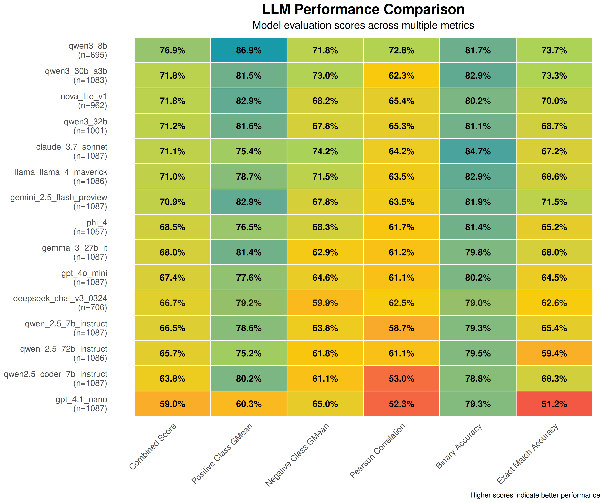
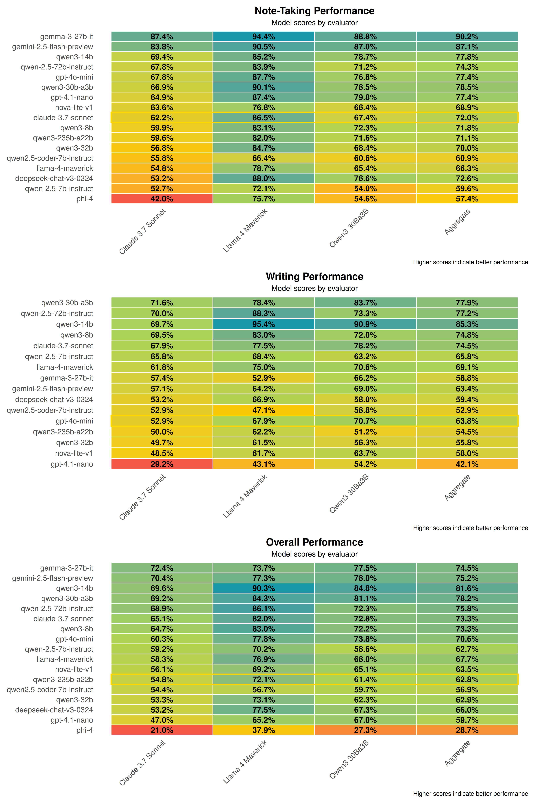

# MAESTRO: LLM Evaluation for Verifier Roles and Agent Performance

To make sure that the MAESTRO research framework produces high quality factual rep, we must thoroughly evaluate the performance of the LLMs in it. However, measuring factual consistency of complex summaries and synthesized reports written by AI is a difficult task in and of itself.

As such, as a preliminary step, we are attempting to find the most reliable LLMs to serve as impartial "judges" or "verifier models". **Currently, this verifier model or LLM-as-judge is not an active participant in the live MAESTRO research pipeline. Instead, this is a preliminary evaluation stage for now.** Our objective at this time is to find which LLMs are better at judging claims, summarizations, and the synthesis of information from multiple sources. These "best-in-class" verifier models will then be used to provide a baseline and validation for the outputs of the LLMs that *are* (or will be) part of the core research pipeline. We intend to integrate such verification capabilities in the MAESTRO workflow (e.g. in the Reflection Agent) directly in a future release.

## Verifier Model Selection Methodology (LLM-as-Judge)

Our preliminary method of selecting some candidate models for the "judge" role was to evaluate various models based on their factual consistency assessment ability on datasets such as QAGS, based on Pearson correlation and the geometric means of the precision and recall of the positive and negative classes. This gave us a high-level overview of potential candidates.

### Improved Verifier Selection

In addition to this, to add some robustness to our selection, we added a new **Combined Score**. This is the g-mean of three quantities:
1.  **Positive Class G-mean:** The g-mean of the sensitivity (true positive rate) and precision for the "positive" class (e.g., "yes" or "supported").
2.  **Negative Class G-mean:** The g-mean of the specificity (true negative rate) and negative predictive value for the "negative" class (e.g., "no" or "refuted").
3.  **Pearson Correlation:** The linear correlation between the model's scores and human judgements.

**Reasoning behind Combined Score:** We chose this g-mean based combined score because we need verifier models that are good at not only identifying clearly supported (positive) or clearly refuted (negative) claims, but also correctly identifying partially supported claims or those with insufficient information. The g-mean ensures that the performance is balanced across these different dimensions, especially when it comes to assessing accuracy of a claim (i.e. fully supported, partially supported, or not supported at all).

The script `evaluation/verifier_verification.py` was used to run these evaluations against various datasets (QAGS, TreatFact, VitaminC) to obtain these metrics.

**Verifier Model Candidate Performance (New Combined Score):**

*Table generated based on the G-mean of positive_class_gmean, negative_class_gmean, and pearson_correlation.*

**Final Verifier Panel Selection Criteria:**
1.  **Good Performance:** High ranking on the new combined score.
2.  **Reliability:** Low rate of refusal or errors from the OpenRouter API service during evaluation. (The `qwen/qwen3_8b` model, while having a high combined score, was noted to have fewer samples evaluated successfully in some of the runs, which could be an indication of higher refusal or error rates, and as such, was deprioritized for the panel)
3.  **Provider Diversity:** To reduce potential systemic biases from a single model provider or training dataset, we ensured diversity of providers for the selected models.

Despite `qwen/qwen3_8b` high score, because it had fewer samples in the released data (due to higher refusal/error rates from the API at the time of testing), and to ensure provider diversity, we looked at the next best models. The Qwen family had two models (`qwen/qwen3_30b_a3b` and `qwen/qwen3_32b`) in the top rankings. To avoid over-representation of a single family and to ensure provider diversity, we picked one of the stronger Qwen models.

**Selected Verifier Panel:**

Based on the above criteria, the following three models were selected to be our "judge" panel for assessing the research and writing capabilities of other LLMs:
1.  **`qwen/qwen3-30b-a3b`**
2.  **`anthropic/claude-3.7-sonnet`**
3.  **`meta-llama/llama-4-maverick`**

## LLM Performance Evaluation Methodology for Research and Writing Tasks

**Note on Model Versions:** All models evaluated in this study used their instruct-tuned versions optimized for following instructions and conversational interactions. For example, the Qwen models tested were the instruct variants (e.g., `qwen/qwen3-30b-a3b` refers to the instruct version), as were all other models in the evaluation.

To evaluate the factual accuracy of the outputs of various LLMs potentially performing the MAESTRO research and writing tasks, we utilized our chosen panel of three verifier models. The evaluation, orchestrated by the `evaluation/llm_accuracy_test.py` script, included access to web search and a RAG database of ~1000 relevant articles. Using a panel of 10 questions of varying complexity, the evaluation consisted of a 2-stage process for each LLM tested:

1.  **Stage 1: Note Generation and Verification (Emulating the Research Agent)**
    *   For each research question, the test LLM (as a Research Agent using the MAESTRO `ResearchAgent` class) consumed some source material (using the the retreival tools currently inclded in MAESTRO, i.e., document and web search) and generated brief "research notes" (instances of the `Note` schema).
    *   Each generated note was then individually verified for factual accuracy against its original source context by **each of the three verifier models**. The verifiers judged the note to be "yes" (fully supported), "no" (refuted/contradicted), or "partial" (partially supported/insufficient info) based on the source context.

2.  **Stage 2: Writing Synthesis and Claim Verification (Emulating the Writing Agent)**
    *   The notes generated by the test LLM in Stage 1 were fed back to the *same* test LLM, now functioning as a Writing Agent (using the MAESTRO `WritingAgent` class), to synthesize a piece of writing.
    *   Individual claims were then extracted from this synthesized written output. The `extract_claims_from_writing` function returns sentences that look like they are associated with citations (e.g., `[doc_id]`).
    *   Each extracted claim was then verified for factual accuracy against the specific research note(s) that were supposed to support it (i.e., the text of the referenced note was considered the context for the claim). This verification was again done independently by **each of the three top verifier models**, which labeled each claim as "yes", "no", or "partial".

**Aggregating Verifier Judgments:**
The resulting scores for each note or claim from the three verifier models are then used to compute a final factuality score. The script `evaluation/score_accuracy_results.py` takes the raw output and processes it. For each item (note or claim), it computes a numerical score based on the verifier's decision ("yes" = 1, "partial" = 0.5 or `1/num_refs` for multi-reference writing, "no" = -1).

The "aggregated" scores in the results table are the sum of the scores of all three verifiers for each LLM for each task (note generation or writing). For the "overall" aggregated score for each LLM, the script computes normalized scores for the 'note' and 'writing' stages independently and then average them with uniform weighting to get a balanced score across both important research tasks.

## Results: LLM Performance in Research and Writing Tasks

The following table summarizes the performance of various LLMs in the note generation and writing synthesis tasks, as assessed by our three-member verifier panel. Scores are in percent, the higher the better. The "aggregated" column shows the verifier panel's combined score.

*Note: "aggregated" scores are based on the combination of the scores of the three verifier models. "Overall" scores are a 50-50 weighted average of the models performance in the "note" generation and "writing" synthesis stages.*

## Recommendations for Agent Roles in MAESTRO

Using our panel of verifier models gives us useful insights into how different LLMs are performing in the simulated research/writing tasks.

**Observations:**
*   **Good Performance across the Board for Qwen and Google Families:** Models from the Qwen family (e.g., `qwen/qwen3-14b`, `qwen/qwen3-30b-a3b`, `qwen/qwen-2.5-72b-instruct`) and Google's models (e.g., `google/gemini-2.5-flash-preview`, `google/gemma-3-27b-it`) perform very well in both the note generation (research agent simulation) and the writing synthesis (writing agent simulation) based on the aggregated scores. `qwen/qwen3-14b` in particular performs very well overall.
*   **Weaknesses in Different Tasks:** Some models are stronger in one task than the other. For example, `google/gemma-3-27b-it` and `google/gemini-2.5-flash-preview` perform very well in the 'note' generation stage, while `qwen/qwen3-14b` is ahead in the 'writing' stage based on the aggregated scores.
*   **Cost-Effective Options:** `openai/gpt-4o-mini` seems to be a reasonable model, especially for simple planning tasks, and could be a reasonable candidate for the `FAST_LLM_PROVIDER` role in MAESTRO. Its overall score seems to indicate that it is a reasonable, low-cost option for less complicated tasks.
*   **Difference of Opinion between Verifiers:** It is also interesting to see how the same generated content is scored by different verifier models. For example, on average, `meta-llama/llama-4-maverick` seems to assign higher scores than `anthropic/claude-3.7-sonnet`. This underscores the value of a verifier panel to help mitigate individual verifier blind-spots.

**Recommendations for MAESTRO Agent Roles:**

MAESTRO has a configurable LLM roster with three levels defined in your `.env` file: `FAST_LLM_PROVIDER`, `MID_LLM_PROVIDER`, and `INTELLIGENT_LLM_PROVIDER`. This allows you to selectively assign different models—or the same model, if you wish—to different agent roles according to the complexity of their tasks and your cost considerations. While you are not required to use three different models in these levels, this structure allows you to have the flexibility to tailor the performance and budget to your needs. For users who wish to run models locally, we also provide self-hosted recommendations, which will require some hardware and setup on your end (e.g., via Ollama, vLLM, etc.).

Based on our findings above, we recommend the following for choosing models for MAESTRO's agent roles:

*   **Planning Agent (`FAST_LLM_PROVIDER`):** This role needs to efficiently structure tasks and produce outlines.
    *   **Top API Choice:** `openai/gpt-4o-mini` has a good mix of capability and cost, and is well-suited for frequent, less computationally expensive tasks such as planning.
    *   **Self-Hosted Recommendation:**
        *   **`qwen/qwen3-8b`**: This model showed good performance for its size in our benchmarks. It gives a good balance between speed and capability for planning tasks.
    *   **Alternative API Choice:** Efficient small Qwen models like `qwen/qwen3-14b` (if accessed via API) can also be used if their cost profile and API performance is reasonable.

*   **Research Agent & Writing Agent (`MID_LLM_PROVIDER`):** These need to be good at comprehension, synthesis and generation with good factual grounding.
    *   **Top Tier API Choices:**
        *   **Qwen Family:** `qwen/qwen3-14b`, `qwen/qwen3-30b-a3b`, and `qwen/qwen-2.5-72b-instruct` have shown very good aggregated performance.
    *   **Strong Alternative API Choices:**
        *   **Google Models:** `google/gemini-2.5-flash-preview` and `google/gemma-3-27b-it` are especially strong for accurate note generation.
        *   `anthropic/claude-3.7-sonnet` has consistently performed very well for both note-taking and writing.
    *   **Self-Hosted Recommendations:**
        *   **`qwen/qwen3-14b`**: With the highest overall aggregated score in our research/writing tests, this is a great self-hosted option for challenging mid-tier tasks.
        *   **`google/gemma-3-27b-it`**: A very strong open model from Google that also performed very well, especially for note generation. It is a good alternative to the Qwen models for self-hosting.
        *   **`qwen/qwen3-30b-a3b`**: Also a very strong performer in the Qwen family.
    *   **Strategic Mix:** Consider using a model like `google/gemini-2.5-flash-preview` (API) or a self-hosted `google/gemma-3-27b-it` for the Research Agent (due to strong note-taking scores) and a model like `qwen/qwen3-14b` (API or self-hosted) for the Writing Agent (due to its strong writing scores).

*   **Reflection Agent (`INTELLIGENT_LLM_PROVIDER` or capable `MID_LLM_PROVIDER`):** This is the most important agent for critically evaluating information quality, identifying knowledge gaps, and suggesting refinements. It benefits from models with strong reasoning and analytical capabilities, likely similar to the models that also performed well in our verifier model evaluations.
    *   **Top API Choices (Utilizing Verifier Strengths & Overall Performance):**
        *   **Verifier Panel Models:** `qwen/qwen3-30b-a3b`, `anthropic/claude-3.7-sonnet`, `meta-llama/llama-4-maverick`. These were chosen because of their strong assessment capabilities.
        *   **High-Performing Verifier Candidates:** `google/gemini-2.5-flash-preview` and `qwen/qwen3-8b` also showed very strong performance in the verifier selection round and are good options for the reflection tasks that require some nuanced judgement.
    *   **Self-Hosted Recommendations:**
        *   **`qwen/qwen3-30b-a3b`**: A member of our verifier selection panel, this showed very strong performance as a verifier candidate and in research/writing tasks. Its capabilities make it a good option for a self-hosted reflection agent.
        *   **`meta-llama/llama-4-maverick`**: Also a member of our verifier panel.
        *   **Larger Qwen Models (e.g., `qwen/qwen-2.5-72b-instruct`):** Larger Qwen family models can also provide better reasoning for the Reflection Agent.
        *   **`google/gemma-3-27b-it`**: While its verifier score was not as high as the top tier of the verifiers, its overall performance and open nature make it a good self-hosted option for a reflection task if other larger models are not feasible.

**General Advice:**
* **Cost vs. Accuracy vs. Infrastructure:** Users should consult the detailed cost tracking features within MAESTRO and cross-reference with these performance metrics. The "best" model for each tier will depend on the specific budget, the required level of accuracy, and the available infrastructure for self-hosting.
* **Iterative Refinement:** The MAESTRO pipeline is designed for iterative research. Even if a model has slight weaknesses, the multi-agent system with planning, research, reflection, and writing loops can help mitigate some of these. The Reflection Agent, when equipped with a capable LLM, plays a key role in this.
* **Ongoing Evaluation:** The LLM landscape is rapidly evolving. These recommendations are based on current data (as of May 2025), and we will continue to evaluate new models as they become available.

## Future Work

Future work will focus on:
*   Adding a robust verifier agent directly into the MAESTRO research pipeline, to provide real-time factuality checks.
*   Keeping updating our evaluation with new models and datasets.
*   Releasing a comprehensive paper about the MAESTRO system architecture and these experimental findings.

We think these findings will help users make more informed decisions when configuring the MAESTRO for their particular research use-cases, taking into account performance, cost, and factual accuracy.
