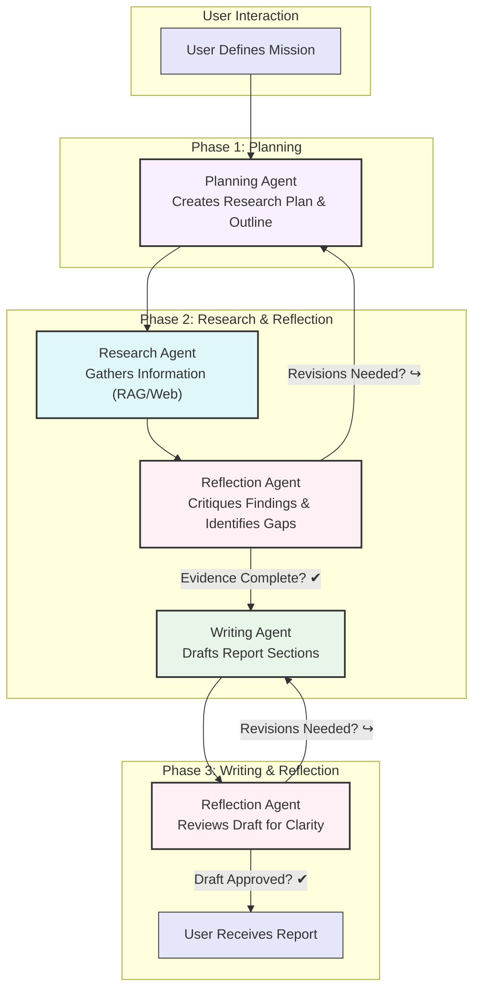

# MAESTRO Architecture

## System Overview

MAESTRO is a sophisticated multi-agent AI system designed for automated research synthesis and report generation. Built on a modern microservices architecture, it employs specialized AI agents that collaborate to plan, execute, critique, and write comprehensive research reports.

## The MAESTRO Research Framework

MAESTRO operates through three distinct phases with built-in reflection and iteration loops:

## Core Components

### The Agent Team

MAESTRO's capabilities are driven by specialized agents, each with distinct responsibilities:

-   :material-robot: **Agent Controller**
    
    *The Orchestrator*
    
    ---
    
    - Manages entire mission lifecycle
    - Coordinates all other agents
    - Maintains mission state and context
    - Composes final research reports
    - Ensures coherent workflow execution

-   :material-strategy: **Planning Agent**
    
    *The Strategist*
    
    ---
    
    - Analyzes research questions
    - Decomposes complex queries into tasks
    - Creates hierarchical report outlines
    - Defines research objectives
    - Adapts plans based on findings

-   :material-magnify: **Research Agent**
    
    *The Investigator*
    
    ---
    
    - Searches uploaded documents using RAG
    - Performs web searches for current information
    - Extracts relevant passages and citations
    - Organizes findings into structured notes
    - Maintains source attribution

-   :material-eye-check: **Reflection Agent**
    
    *The Critical Reviewer*
    
    ---
    
    - Reviews research for completeness
    - Identifies knowledge gaps and contradictions
    - Evaluates argument coherence
    - Suggests additional research directions
    - Ensures fidelity to sources

-   :material-typewriter: **Writing Agent**
    
    *The Synthesizer*
    
    ---
    
    - Transforms research notes into prose
    - Maintains consistent narrative voice
    - Integrates citations and references
    - Follows established report structure
    - Ensures clarity and readability

### Technical Stack

-   :material-server: **Backend Services**
    
    ---
    
    - **FastAPI** - High-performance API framework
    - **SQLAlchemy** - ORM for database operations
    - **LangChain** - LLM orchestration
    - **BGE-M3** - Dual embedding model
    - **AsyncIO** - Asynchronous task processing

-   :material-database: **Database Layer**
    
    ---
    
    - **PostgreSQL** - Primary database with pgvector
    - **JSONB** - Flexible metadata storage
    - **UUID** - Unique identifiers throughout
    - **Vector Storage** - Hybrid dense/sparse embeddings

-   :material-application: **Frontend**
    
    ---
    
    - **React** - Component-based UI
    - **TypeScript** - Type-safe development
    - **WebSockets** - Real-time communication
    - **Material-UI** - Design system

-   :material-docker: **Infrastructure**
    
    ---
    
    - **Docker Compose** - Container orchestration
    - **Nginx** - Reverse proxy and load balancing
    - **GPU Support** - CUDA acceleration for embeddings
    - **Volume Management** - Persistent data storage

## Key Architectural Decisions

### Why Multi-Agent Architecture?

-   :material-puzzle: **Specialization**
    
    ---
    
    Each agent focuses on specific tasks:

    - Higher quality outputs in each phase
    - More efficient processing
    - Clear responsibility boundaries
    - Easier debugging and improvement

-   :material-refresh: **Iteration & Refinement**
    
    ---
    
    Built-in reflection loops ensure:

    - Continuous quality improvement
    - Error detection and correction
    - Comprehensive topic coverage
    - Adaptation to emerging insights

-   :material-eye: **Transparency**
    
    ---
    
    The approach provides:

    - Clear visibility into research process
    - Traceable decision-making
    - Auditable research paths
    - Explainable outcomes

-   :material-tune: **Flexibility**
    
    ---
    
    Modular design enables:

    - Easy addition of new agents
    - Customization of agent behaviors
    - Adaptation to different research styles
    - Scaling to complex topics

### Technology Choices

-   :material-database-outline: **PostgreSQL with pgvector**
    
    ---
    
    - **Single Database Solution** - Combines relational and vector data
    - **ACID Compliance** - Full transactional support
    - **Native UUID Support** - Efficient unique identifiers
    - **JSONB Fields** - Flexible schema for metadata
    - **Production Ready** - Battle-tested at scale

-   :material-docker: **Docker Compose**
    
    ---
    
    - **Simple Deployment** - One command to start everything
    - **Environment Consistency** - Same behavior across platforms
    - **Service Isolation** - Clean separation of concerns
    - **Easy Updates** - Pull new images and restart
    - **Resource Management** - Efficient container orchestration

## Data Flow Architecture

### Document Processing Pipeline
1. **Upload** → Generate UUID → SHA256 deduplication
2. **Store** → PostgreSQL record → Raw file to disk
3. **Convert** → PDF (Marker), Word (python-docx), Markdown (direct)
4. **Extract** → LLM metadata extraction
5. **Chunk** → Overlapping paragraphs
6. **Embed** → Dual BGE-M3 embeddings (dense + sparse)
7. **Index** → Store in PostgreSQL with pgvector

### Research Execution Flow
1. **Mission Creation** → User defines objectives
2. **Planning** → Generate research outline
3. **Research Loop** → Gather and validate information
4. **Writing Loop** → Draft and refine content, deliver report

## Performance Characteristics

-   :material-file-document: **Document Processing**
    
    ---
    
    - **Small PDFs** (< 10 pages): 1-2 minutes
    - **Large PDFs** (100+ pages): 5-10 minutes
    - **Batch Processing**: Batch processing for concurrent document ingestion
    - **GPU Acceleration**: 5-30x faster with NVIDIA GPU

-   :material-magnify-plus: **Search Performance**
    
    ---
    
    - **Semantic Search**: < 500ms for typical queries
    - **Hybrid Search**: < 1s with reranking
    - **Document Retrieval**: < 100ms from cache

## Security Model

-   :material-shield-check: **Defense in Depth**
    
    ---
    
    1. **Network Layer** - Single entry point through nginx
    2. **Application Layer** - JWT session authentication
    3. **Database Layer** - Parameterized queries, no SQL injection
    4. **File System** - Type validation, size limits
    5. **Configuration** - Environment variables for secrets

-   :material-lock: **Data Privacy**
    
    ---
    
    - **Self-Hosted** - Complete data sovereignty
    - **Local Processing** - No data leaves your infrastructure
    - **Encrypted Storage** - Passwords hashed with bcrypt
    - **Audit Trail** - Complete logging of operations

<!-- ## Scalability

-   :material-arrow-expand-vertical: **Vertical Scaling**
    
    ---
    
    - Add more CPU cores for parallel processing
    - Increase RAM for larger model context
    - Add GPU for faster document processing
    - Use NVMe SSD for database performance

-   :material-arrow-expand-horizontal: **Horizontal Scaling**
    
    ---
    
    - Multiple backend instances behind load balancer
    - Read replicas for PostgreSQL
    - Distributed file storage (NFS/S3)
    - Container orchestration with Kubernetes

 -->

## Configuration & Customization

-   :material-cog: **Agent Parameters**
    
    ---
    
    - **Model Selection** - Choose appropriate LLM for each agent
    - **Iteration Limits** - Balance thoroughness with efficiency

-   :material-target: **Mission Settings**
    
    ---
    
    - **Research Depth** - Number of sources to explore
    - **Iteration Rounds** - Maximum refinement cycles
    - **Output Format** - Report structure preferences
    - **Focus Areas** - Emphasize specific aspects

-   :material-api: **Provider Options**
    
    ---
    
    - **LLM Providers** - OpenAI, OpenRouter, Local models, any OpenAI compatible API provider
    - **Search Providers** - Tavily, LinkUp, Jina, SearXNG
    - **Document Formats** - PDF, Word, Markdown support
    - **Output Formats** - Formatted reports as Markdown or Word files

## API Architecture

### RESTful Endpoints
- `/api/auth/*` - Authentication and user management
- `/api/documents/*` - Document operations
- `/api/chat/*` - Chat interactions
- `/api/missions/*` - Research mission management
- `/api/writing/*` - Writing mode operations

### WebSocket Channels
- Real-time chat responses
- Mission progress updates
- Document processing status
- System notifications

## Database Schema

### Core Tables
- **users** - User authentication and profiles
- **documents** - Document metadata and processing status
- **document_chunks** - Vectorized document segments
- **chats** - Conversation sessions
- **missions** - Research mission tracking
- **messages** - Chat and mission messages
- **drafts** - Writing mode drafts

### Vector Storage
- **PostgreSQL with pgvector**:
  - `dense_embedding` - BGE-M3 dense embeddings (1024 dimensions)
  - `sparse_embedding` - BGE-M3 sparse embeddings stored as JSONB
- **Hybrid Search** - Configurable weights for dense/sparse retrieval
- **HNSW Index** - Fast approximate nearest neighbor search

## Docker Architecture

-   :material-package-variant: **Service Containers**
    
    ---
    
    - **maestro-backend** - Main API and agent orchestration
    - **maestro-frontend** - React web interface
    - **maestro-postgres** - PostgreSQL with pgvector
    - **maestro-nginx** - Reverse proxy and static files
    - **doc-processor** - Document processing service

-   :material-harddisk: **Volume Management**
    
    ---
    
    - `./maestro_backend/data` - Document storage
    - `./maestro_model_cache` - Model caches
    - `./reports` - Generated reports
    - PostgreSQL data persisted in Docker volumes

-   :material-network: **Network Architecture**
    
    ---
    
    - Internal Docker network for service communication
    - Single external entry point through nginx
    - Port 80/443 for web access
    - WebSocket upgrade support

## Monitoring & Observability

-   :material-text-box-outline: **Logging**
    
    ---
    
    - Application logs via Python logging
    - Container logs via Docker
    - Nginx access and error logs
    - Database query logs (development)

-   :material-chart-line: **Metrics**
    
    ---
    
    - API response times
    - Document processing rates
    - Search performance
    - Agent execution times
    - Resource utilization

## Future Enhancements

-   :material-rocket-launch: **Planned Features**
    
    ---
    
    - **Additional Agents** - Fact-checker, Citation Manager
    - **Enhanced Collaboration** - Multi-user research teams
    - **Knowledge Graphs** - Structured knowledge representation
    - **Multi-modal Research** - Image and video analysis

-   :material-graph: **Architecture Evolution**
    
    ---
    
    - Kubernetes deployment options
    - Microservices decomposition
    - Event-driven architecture
    - GraphQL API layer
    - Real-time collaboration features

MAESTRO's architecture combines the power of specialized AI agents with robust infrastructure to deliver a sophisticated research automation platform. The multi-agent design ensures high-quality outputs through iterative refinement, while the modern technical stack provides scalability, security, and flexibility for diverse research needs.

The system's modular architecture allows for continuous improvement and adaptation, making it suitable for everything from individual researchers to enterprise deployments.