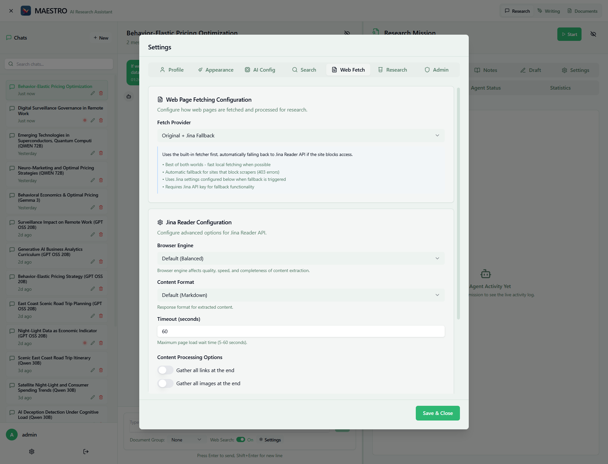

# Web Fetch Configuration

Configure how MAESTRO fetches and processes full content from web pages discovered during research.



## Overview

Web fetching is crucial for MAESTRO's ability to:

- Extract complete articles beyond search snippets
- Read JavaScript-rendered content
- Process PDFs and complex documents
- Gather supporting evidence for research

## Fetch Providers

MAESTRO offers three web fetching strategies to handle different types of web content.

### Original + Jina Fallback (Recommended)

The default configuration that provides the best balance of speed, reliability, and cost.

**How it works:**

1. **First attempt**: Uses built-in fetcher (fast, free)
2. **On failure**: Automatically falls back to Jina API
3. **Result**: High success rate with minimal API usage

**Configuration:**

- No setup required for basic use
- Add Jina API key for fallback functionality
- Automatic switching based on site requirements

### Original (Built-in Fetcher)

MAESTRO's native web fetching using open-source libraries.

**Features:**

- **Zero cost** - No API fees
- **Fast processing** - Direct extraction
- **PDF support** - Native PDF handling
- **Offline capable** - No external dependencies

**Limitations:**

- Cannot handle JavaScript-rendered content
- May be blocked by anti-scraping measures
- Limited by site protections (403 errors)

**Best for:**

- Static HTML pages
- News articles
- Documentation sites
- PDF documents

### Jina Reader API

Advanced fetching using Jina's browser rendering engine.

**Features:**

- **JavaScript rendering** - Full browser emulation
- **Anti-blocking** - Bypasses most protections
- **High quality** - Superior content extraction
- **Complex sites** - Handles modern web apps

**Requirements:**

- Jina API key from [jina.ai](https://jina.ai)
- Same key works for both search and fetch if using Jina search

**Best for:**

- Single-page applications (SPAs)
- JavaScript-heavy sites
- Sites that block scrapers
- Paywalled content (respecting ToS)

## Configuration Settings

### Browser Engine (Jina Only)

Controls how Jina renders web pages:

- **Default** - Balanced speed and completeness
- **Fast** - Quick extraction, may miss dynamic content
- **Complete** - Full rendering, captures everything

### Content Format

Choose output format based on your needs:

- **Markdown** - Structured, preserves formatting (recommended)
- **HTML** - Raw HTML for custom processing
- **Text** - Plain text, smallest size

### Timeout Settings

Maximum wait time for page loading:

```yaml
Recommended timeouts:
- Static sites: 10-15 seconds
- Dynamic sites: 30 seconds  
- Complex apps: 45-60 seconds
```

### Processing Options

Additional extraction features:

- **Gather all links** - Extract hyperlinks for reference
- **Gather all images** - Collect image URLs

## Setup Instructions

### Using Original + Fallback (Recommended)

1. **No configuration needed** for basic use
2. **Optional**: Add Jina API key for enhanced reliability
3. **Automatic operation** - System handles provider selection

### Setting Up Jina Reader

1. **Get API Key**
   ```bash
   # Visit jina.ai
   # Create developer account
   # Generate API key
   ```

2. **Configure in MAESTRO**
   - Navigate to Settings → Web Fetch
   - Select "Jina Reader API" or "Original + Jina Fallback"
   - Enter API key (uses same key as Jina search if configured)
   - Choose browser engine and format
   - Set appropriate timeout

3. **Test Configuration**
   - Try fetching a JavaScript-heavy site
   - Verify content extraction quality

### Environment Variables

Configure via environment for production:

```bash
# Jina Configuration
JINA_API_KEY=jina_xxxxxxxxxxxxx
JINA_BROWSER_ENGINE=default  # default, fast, or complete
JINA_CONTENT_FORMAT=markdown # markdown, html, or text
JINA_TIMEOUT=30              # seconds

# Fetch Strategy
WEB_FETCH_PROVIDER=original_with_fallback  # original, jina, or original_with_fallback
```

## Usage Patterns

### In Research Missions

Web fetching automatically activates when:

- Following search result links
- Extracting cited sources
- Gathering supporting evidence
- Verifying claims with primary sources

### Performance Optimization

#### For Speed
```yaml
Provider: Original
Timeout: 10-15 seconds
Browser: Fast (if using Jina)
Options: Minimal
```

#### For Quality
```yaml
Provider: Jina Reader
Timeout: 30-45 seconds
Browser: Complete
Options: All enabled
```

#### For Cost Efficiency
```yaml
Provider: Original + Fallback
Timeout: 20 seconds
Browser: Default
Options: As needed
```

## Common Use Cases

### News and Articles

Most news sites work well with the original fetcher:

- **Provider**: Original
- **Timeout**: 10-15 seconds
- **Format**: Markdown

### Academic Papers

PDFs and research repositories:

- **Provider**: Original (handles PDFs natively)
- **Timeout**: 20-30 seconds
- **Format**: Markdown

### Modern Web Apps

JavaScript-heavy applications:

- **Provider**: Jina Reader
- **Engine**: Complete
- **Timeout**: 45 seconds
- **Format**: Markdown

### Technical Documentation

API docs and developer resources:

- **Provider**: Original + Fallback
- **Format**: Markdown
- **Options**: Gather links enabled

## Troubleshooting

### 403 Forbidden Errors

**Issue**: Site blocks the fetcher

**Solutions**:
1. Enable Jina fallback
2. Switch to Jina Reader
3. Increase timeout
4. Check site's robots.txt

### Incomplete Content

**Issue**: Missing page sections

**Solutions**:
1. Use Complete browser mode (Jina)
2. Increase timeout to 45+ seconds
3. Enable JavaScript rendering
4. Switch from Original to Jina

### Slow Fetching

**Issue**: Takes too long

**Solutions**:
1. Reduce timeout appropriately
2. Use Fast browser mode
3. Switch to Original for static sites
4. Check network connectivity

### Empty or Malformed Content

**Issue**: No content or broken formatting

**Solutions**:
1. Try different content format
2. Use Markdown for better structure
3. Enable link/image gathering
4. Check if site requires authentication

## Cost Considerations

### API Usage

- **Original**: Free, unlimited
- **Jina**: Charged per request
- **Fallback**: Minimal API usage

## Best Practices

### Provider Selection

1. **Start with Original + Fallback** - Best for most users
2. **Monitor success rates** - Track which sites fail
3. **Adjust per use case** - Optimize based on content types
4. **Document patterns** - Note which sites need Jina

## Integration with Other Features

### Search Providers

- Jina search and fetch share API keys
- Consistent provider reduces complexity
- Unified billing and monitoring

### Research Configuration

- Fetch timeout affects mission duration
- Quality settings impact research depth
- Balance speed vs. completeness

## Provider Comparison

| Feature | Original | Jina | Original + Fallback |
|---------|----------|------|-------------------|
| **Cost** | Free | Per request | Minimal |
| **Speed** | Fast (1-5s) | Slow (10-30s) | Variable |
| **JavaScript** | ❌ | ✅ | ✅ (fallback) |
| **Success Rate** | medium | high | high |
| **Setup** | None | API key | Optional API key |

## Next Steps

- [Environment Variables](environment-variables.md) - System configuration
- [AI Provider Configuration](ai-providers.md) - LLM setup
- [Search Provider Configuration](search-providers.md) - Web search setup
- [First Login](../first-login.md) - Initial setup guide