# MAESTRO Documentation

  
  
  <h3 style="margin-top: 1rem;">Your Self-Hosted AI Research Assistant</h3>
  
  

    
    
    
  

---

## Welcome to MAESTRO

What is MAESTRO?

MAESTRO is an <strong>AI-powered research platform</strong> you can host on your own hardware. It's designed to manage complex research tasks from start to finish in a collaborative research environment.

**Transform your research workflow:** Plan your research questions → Let AI agents investigate → Receive comprehensive reports with citations

### Why Choose MAESTRO?

:material-brain: **Advanced AI Integration**  
Leverage multiple LLMs including GPT-5, Claude, and local models for diverse research capabilities

:material-magnify: **Deep Document Analysis**  
Advanced RAG pipeline with dual embeddings for superior search accuracy

:material-refresh: **Iterative Research Process**  
Multi-agent system that refines findings through reflection and critique loops

:material-lock-outline: **Complete Data Privacy**  
Self-hosted solution ensures your sensitive research never leaves your infrastructure

## Quick Links

-   **[Quick Start](getting-started/quickstart.md)**
    
    Get MAESTRO up and running in minutes with Docker

-   **[Installation](getting-started/installation/index.md)**
    
    Detailed installation instructions for various platforms

-   **[User Guide](user-guide/index.md)**
    
    Learn how to use all of MAESTRO's features

-   **[Example Reports](example-reports/index.md)**
    
    See real research outputs from various AI models

## Core Features

-   :material-file-document-multiple: **Document Management**
    
    ---
    
    Upload and manage your research documents in a central library
    
    - PDF, Word, and Markdown support
    - Advanced RAG pipeline with BGE-M3 embeddings
    - Semantic search across all documents
    - Document groups for organized research

-   :material-robot: **Intelligent Research**
    
    ---
    
    AI agents conduct thorough research based on your requirements
    
    - Multi-agent system with 5 specialized agents
    - Iterative research with reflection loops
    - Automatic source citation and tracking
    - Customizable research depth and focus

-   :material-typewriter: **Writing Assistant**
    
    ---
    
    AI-powered writing support for reports and documentation
    
    - Context-aware suggestions from your library
    - Real-time collaborative editor
    - LaTeX formula support
    - Reference management and citations

-   :material-web: **Web Integration**
    
    ---
    
    Seamlessly search and fetch content from the internet
    
    - Multiple search providers (Tavily, LinkUp, Jina)
    - Automatic content extraction and parsing
    - JavaScript-heavy site support
    - Smart query expansion

-   :material-account-group: **Multi-User Support**
    
    ---
    
    Built for collaborative research environments
    
    - Role-based access control
    - Personal document libraries
    - Shared research missions
    - Individual settings and preferences

-   :material-shield-lock: **Self-Hosted Privacy**
    
    ---
    
    Complete control over your data and infrastructure
    
    - Run on your own hardware
    - No data leaves your servers
    - Support for local LLMs
    - Full audit trail and logging

## System Requirements

### :material-check-circle: **Minimum Requirements**

- Docker & Docker Compose v2.0+
- 16GB RAM
- 30GB free disk space
- Internet connection
- API keys for at least one AI provider

### :material-rocket: **Recommended Setup**

- 32GB+ RAM for better performance
- 50GB+ SSD storage
- NVIDIA GPU for 3-5x faster processing
- Multiple AI provider keys
- Local LLM capability (RTX 3090/4090)

## Architecture Overview

MAESTRO is built with a modern, scalable architecture:

```mermaid
graph TB
    subgraph "Client"
        A[React Frontend]
    end
    
    subgraph "Gateway"
        B[Nginx Reverse Proxy]
    end
    
    subgraph "Backend Services"
        C[FastAPI Server]
        D[Multi-Agent System<br/>Controller • Planning • Research<br/>Reflection • Writing]
        E[RAG Pipeline<br/>BGE-M3 Embeddings]
    end
    
    subgraph "Data Layer"
        F[(PostgreSQL + pgvector<br/>Documents • Vectors • Chats)]
        G[File Storage<br/>PDFs • Markdown]
    end
    
    subgraph "External"
        H[AI Providers<br/>OpenAI • Anthropic • Local LLMs]
        I[Search Providers<br/>Tavily • LinkUp • Jina]
    end
    
    A --> B
    B --> C
    C --> D
    C --> E
    D --> E
    E --> F
    C --> F
    C --> G
    D --> H
    D --> I
    
    style F fill:#e1f5fe,stroke:#01579b,stroke-width:2px
    style D fill:#f3e5f5,stroke:#4a148c,stroke-width:2px
```

## Documentation Sections

### Getting Started

- **[Quick Start](getting-started/quickstart.md)** - Get up and running in minutes
- **[Installation](getting-started/installation/index.md)** - Platform-specific installation guides
- **[Configuration](getting-started/configuration/overview.md)** - Configure AI providers and settings
- **[First Login](getting-started/first-login.md)** - Initial setup and user creation

### Using MAESTRO

- **[User Guide](user-guide/index.md)** - Complete guide to all features
- **[Research](user-guide/research/overview.md)** - Creating and managing research missions
- **[Writing](user-guide/writing/overview.md)** - Using the AI writing assistant
- **[Documents](user-guide/documents/overview.md)** - Managing your document library
- **[Settings](user-guide/settings/overview.md)** - Customizing your experience

### Advanced Topics

- **[Architecture](architecture/index.md)** - System design and components
- **[Local LLM Deployment](deployment/local-llms.md)** - Running models on your hardware
- **[Example Reports](example-reports/index.md)** - Sample outputs from various models
- **[Troubleshooting](troubleshooting/index.md)** - Solutions to common issues

## Latest Updates

-   :material-rocket: **Version 0.1.5-alpha** <small>Released Sep 2, 2025</small>
    
    ---
    
    **Major Performance & Stability Update**
    
    - Complete async backend migration (2-3x faster)
    - Fixed mission resume and recovery capabilities
    - Complete documentation overhaul
    - Enhanced UI/UX with LaTeX support
    - 50+ bug fixes and stability improvements
    - **Note:** This is an alpha release with significant improvements

-   :material-new-box: **Version 0.1.4** <small>Released Aug 20, 2025</small>
    
    ---
    
    **Jina.ai Integration & Enhanced Search**
    
    - Jina.ai provider for advanced web content fetching
    - Automatic query expansion for vague references
    - Better JavaScript-heavy site handling
    - Improved content extraction accuracy

## Join the Community

-   :material-github: **GitHub**
    
    [View Repository](https://github.com/murtaza-nasir/maestro){ .md-button }
    
    Source code, issues, and contributions

-   :material-forum: **Discussions**
    
    [Join Community](https://github.com/murtaza-nasir/maestro/discussions){ .md-button }
    
    Ask questions and share experiences

-   :material-road-variant: **Roadmap**
    
    [View Plans](community/roadmap.md){ .md-button }
    
    See what's coming next

## License

MAESTRO is open source software licensed under the [GNU Affero General Public License v3.0](license.md), ensuring it remains free and open for everyone.

---

🚀 Ready to Transform Your Research?

  <a href="getting-started/installation/docker/" class="md-button md-button--primary" style="margin: 0.5rem;">
    🐳 Install with Docker
  </a>
  <a href="getting-started/quickstart/" class="md-button" style="margin: 0.5rem;">
    ⚡ Quick Start Guide
  </a>
  <a href="user-guide/" class="md-button" style="margin: 0.5rem;">
    📚 Read Documentation
  </a>

<strong>Join hundreds of researchers using MAESTRO to accelerate their work</strong>

