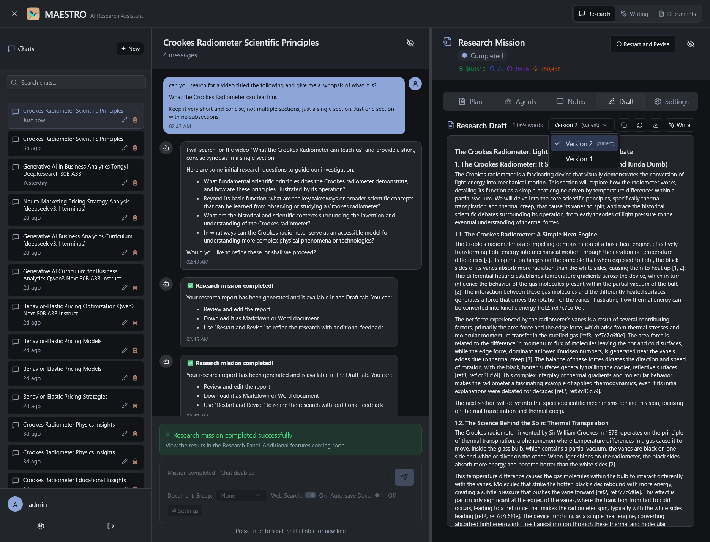
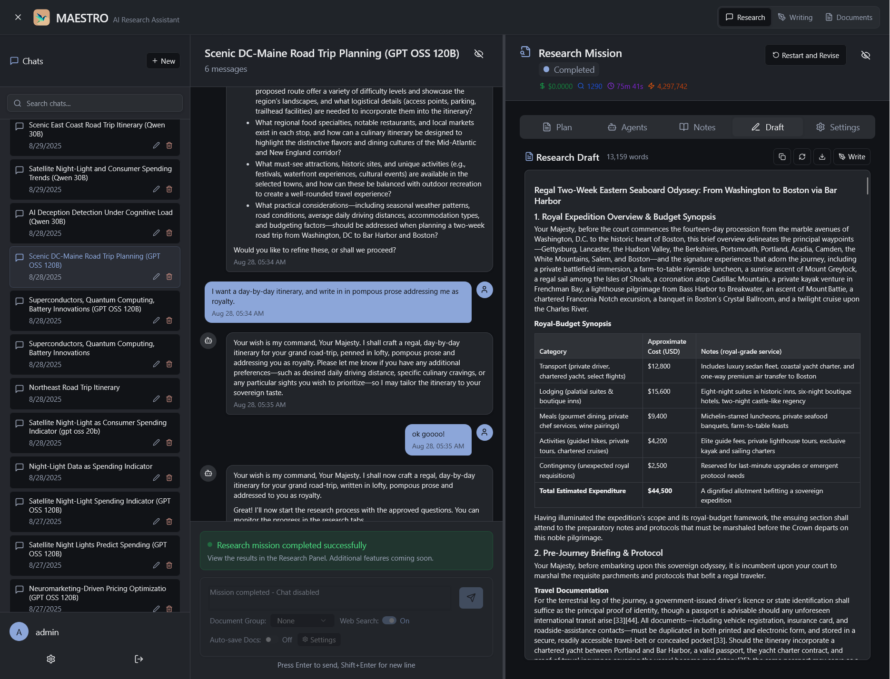
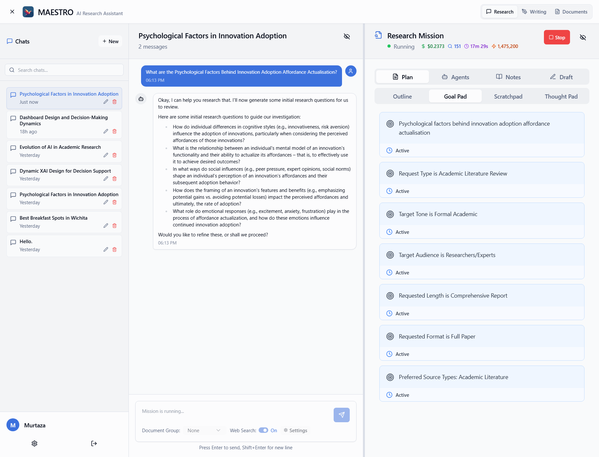
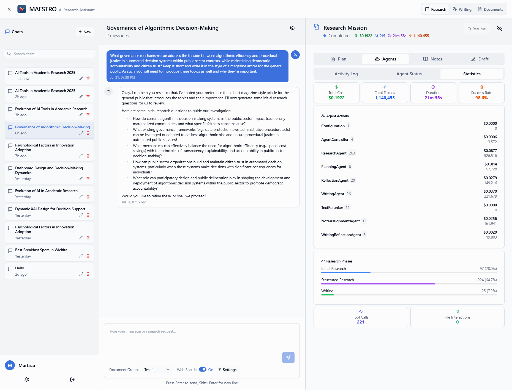
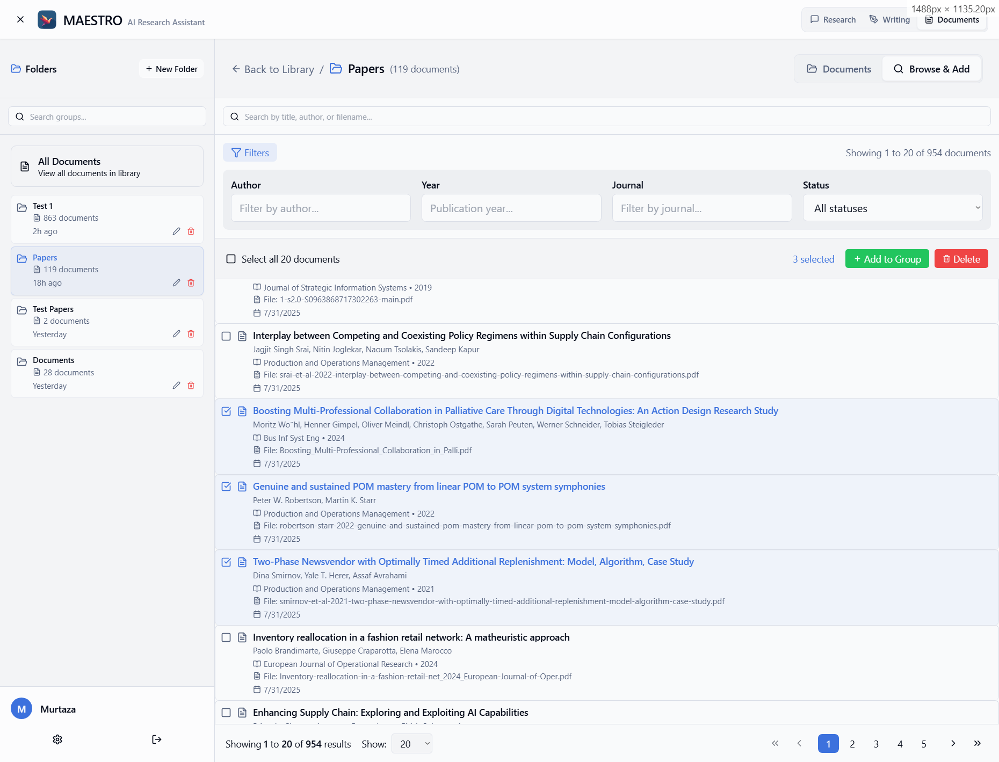
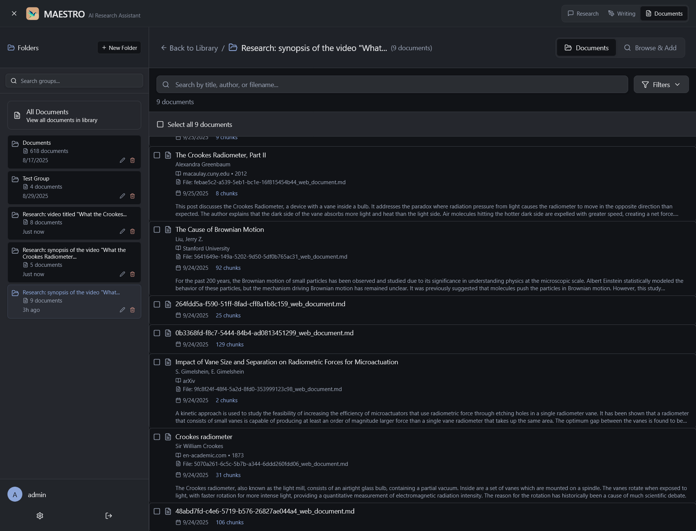

# Screenshots

Visual overview of MAESTRO's key features and interfaces.

## Research Workspace

### Research Report Generation
The main research interface showing a completed research report with structured sections, citations, and formatting.

### Report Versioning
Track and switch between different versions of your research reports after revisions.

### Research to Writing Transition
Seamlessly transition from research mode to writing mode while preserving context and document groups.

### Alternative Report Views
Different examples of generated research reports showcasing various styles and formats.

## Research Views

### Research Overview
Main research interface showing the mission in progress.

### Plan View
Strategic planning phase where AI agents create detailed research outlines.

### Notes View
Comprehensive notes collected during research with source tracking.

### Draft View
Live preview of the research report as it's being generated.

### Settings View
Configure research parameters, AI models, and document groups.

## Writing Workspace

### Writing Editor
AI-powered writing assistant with real-time preview and formatting support.

### Writing Chat
Interactive chat interface for writing assistance and suggestions.

### Additional Instructions
Provide specific guidance to the AI writing assistant.

### References in Chat
AI assistant can reference and cite documents from your library.

### LaTeX and Markdown Support
Full support for formulas and tables in LaTeX and Markdown.

## Mission Management

### Mission Settings
Configure mission parameters before starting research.

### Mission Tracking
Monitor progress and status of your research missions.

### Agent Reflection
Watch AI agents reflect and improve their research approach.

## Document Management

### Document Library
Central repository for all your research documents with advanced search and filtering.

### Document Groups
Organize documents into collections for focused research sessions.

### Auto-Create Document Groups
Automatically create and populate document groups from web sources discovered during research.

### Document Management Features

