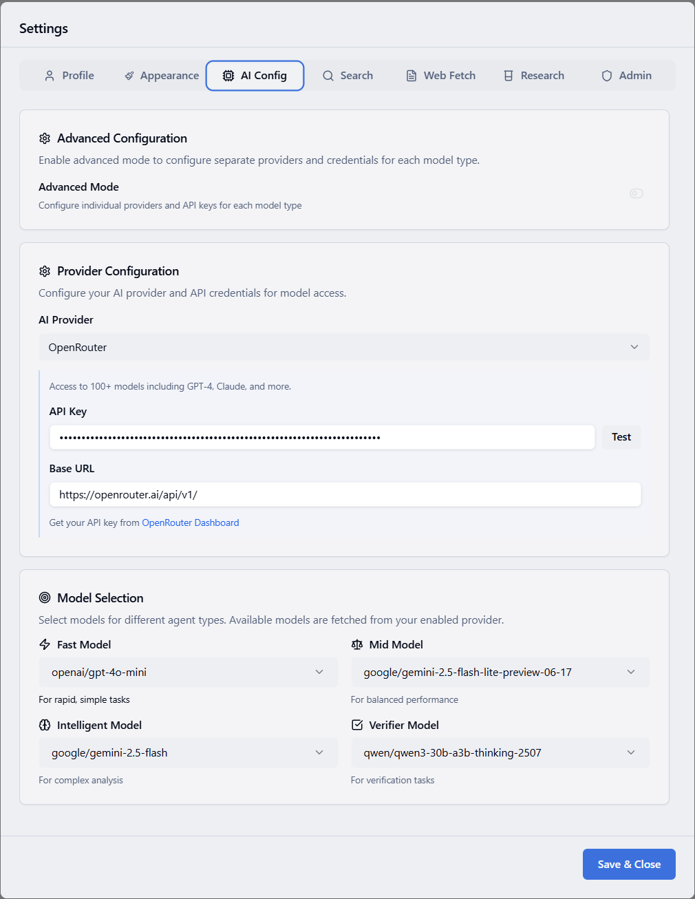

# AI Model Troubleshooting

Quick fixes for AI model configuration and API issues.

## Configuration Issues

### No Models in Dropdown

**Solution:**

1. Go to Settings → AI Config
2. Select provider (OpenAI, OpenRouter, or Custom Provider)
3. Enter API key
4. Click "Test" button
5. Models should populate automatically



**If still empty:**
```bash
# Check logs for errors
docker compose logs maestro-backend | grep -i "api\|model"

# Restart backend
docker compose restart maestro-backend
```

### Wrong Model Being Used

**Check current configuration:**

1. Go to Settings → AI Config
2. Verify each model type is set correctly:
   - Fast Model: For quick tasks
   - Mid Model: For balanced performance
   - Intelligent Model: For complex analysis
   - Verifier Model: For verification

## API Issues

### Authentication Failed

**Error:** Invalid API key

**Solution:**
```bash
# Test OpenAI key
curl https://api.openai.com/v1/models \
  -H "Authorization: Bearer YOUR_API_KEY"

# Test OpenRouter key
curl https://openrouter.ai/api/v1/models \
  -H "Authorization: Bearer YOUR_API_KEY"
```

### Rate Limit Errors

**Error:** Rate limit exceeded

**Solution:**
```bash
# Configure retry settings in .env
MAX_RETRIES=3
RETRY_DELAY=5
MAX_CONCURRENT_REQUESTS=2

# Restart
docker compose restart maestro-backend
```

### Context Too Large

**Error:** Context length exceeded

**Solution in Settings → Research:**

- Reduce `writing_agent_max_context_chars` (e.g., 100,000)
- Reduce `main_research_doc_results` (e.g., 3)
- Reduce `main_research_web_results` (e.g., 3)

## Provider-Specific Issues

### OpenAI

**Common issues:**

- Wrong API key format
- Insufficient credits
- Model not available in your region

**Check account:**
```bash
# Check usage
curl https://api.openai.com/v1/usage \
  -H "Authorization: Bearer YOUR_KEY"
```

### OpenRouter

**Model not found:**
```bash
# Use full model path
# Correct: anthropic/claude-3-sonnet
# Wrong: claude-3-sonnet

# Check available models
curl https://openrouter.ai/api/v1/models \
  -H "Authorization: Bearer YOUR_KEY"
```

### Custom Provider

**Connection failed:**
```bash
# Test endpoint
curl YOUR_CUSTOM_BASE_URL/v1/models

# Common base URLs:
# Local vLLM: http://localhost:5000/v1
# Local SGLang: http://localhost:30000/v1
```

## Performance Issues

### Slow Response

**Quick fixes:**

1. Use faster models (e.g., gpt-4o-mini)
2. Reduce context sizes in Research settings
3. Check network latency to API

### High Costs

**Reduce costs:**

1. Use cheaper models for Fast/Mid tiers
2. Reduce research parameters:
    - `initial_research_max_questions`
    - `structured_research_rounds`
    - `writing_passes`

## Debugging

### Enable Debug Logging

```bash
# In .env
LOG_LEVEL=DEBUG

# Restart
docker compose restart maestro-backend

# Watch logs
docker compose logs -f maestro-backend | grep -i "model\|api"
```

### Test Models Directly

```bash
# Check configured models
docker exec maestro-backend python -c "
from ai_researcher.dynamic_config import get_fast_model_name, get_mid_model_name, get_intelligent_model_name
print('Fast:', get_fast_model_name())
print('Mid:', get_mid_model_name())
print('Intelligent:', get_intelligent_model_name())
"
```

## Common Error Messages

| Error | Solution |
|-------|----------|
| "API key invalid" | Check key in Settings → AI Config |
| "Model not found" | Use full model path (provider/model) |
| "Rate limit exceeded" | Wait or upgrade API plan |
| "Context length exceeded" | Reduce context in Research settings |
| "Connection timeout" | Check network/firewall |

## Quick Fixes

### Reset AI Configuration

```bash
# Clear settings and reconfigure
docker exec maestro-postgres psql -U maestro_user -d maestro_db -c "
UPDATE users SET settings = settings - 'ai_endpoints' WHERE username = 'admin';
"

# Then reconfigure in web UI
```

### Switch to Local Models

```bash
# In Settings → AI Config
# Select "Custom Provider"
# Base URL: http://your-server:5000/v1
# Model: localmodel
```

## Still Having Issues?

1. Check logs: `docker compose logs maestro-backend`
2. Verify API keys are valid
3. Check provider status pages
4. Try different models