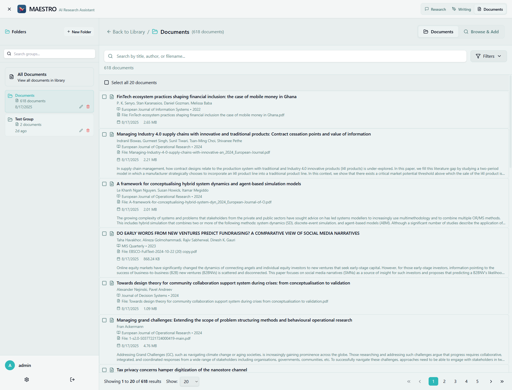
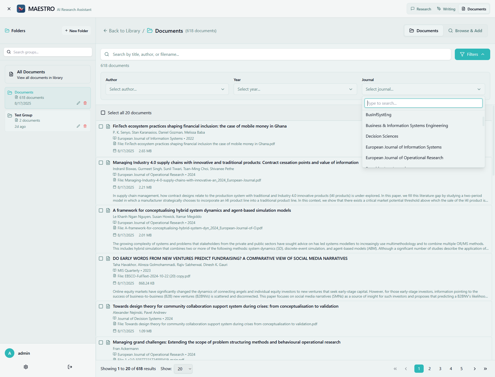

# Document Groups

Document Groups allow you to organize your library into logical collections, making it easier to manage large document sets and focus research on specific topics.



## What are Document Groups?

Document Groups are:
- **Collections** of related documents
- **Project-based** organization tools
- **Research contexts** for focused analysis
- **Shareable** document sets
- **Dynamic** collections that can be modified

## Creating Groups

### Via Web Interface
1. Navigate to **Documents** tab
2. Click **"Create Group"** button
3. Enter group name and description
4. Click **"Create"** to save
5. Group appears in groups list

### Via CLI
```bash
# Create a new group
./maestro-cli.sh create-group [username] "Group Name"

# With description
./maestro-cli.sh create-group [username] "Group Name" --description "Description"
```

### Group Properties
Each group has:
- **Name**: Descriptive title
- **Description**: Purpose and contents
- **Document Count**: Number of documents
- **Created Date**: When established
- **Last Modified**: Recent changes
- **Owner**: Creator username

## Managing Groups

### Adding Documents to Groups

#### Single Document
1. Select document in library
2. Click **"Add to Group"** button
3. Choose target group(s)
4. Click **"Add"** to confirm

#### Batch Addition
1. Select multiple documents
2. Click **"Add to Groups"**
3. Select one or more groups
4. Apply to all selected

#### During Upload
1. Start document upload
2. Select **"Add to Group"** option
3. Choose existing group
4. Documents automatically added

### Removing Documents

#### Individual Removal
1. Open group view
2. Select document to remove
3. Click **"Remove from Group"**
4. Document remains in library

#### Batch Removal
1. Select multiple documents in group
2. Click **"Remove Selected"**
3. Confirm removal
4. Documents stay in main library

## Group Operations

### Viewing Group Contents


Group view shows:
- **Document List**: All documents in group
- **Group Statistics**: Count, size, types
- **Quick Actions**: Add, remove, export
- **Search Within Group**: Focused search
- **Sort Options**: Organize display

### Editing Groups

#### Rename Group
1. Click group name or edit icon
2. Enter new name
3. Press Enter or click Save
4. Name updates everywhere

#### Update Description
1. Click description area
2. Edit text
3. Save changes
4. Description updates

### Deleting Groups

#### Delete Empty Group
1. Select empty group
2. Click **"Delete Group"**
3. Confirm deletion
4. Group removed

#### Delete Group with Documents
1. Select group with documents
2. Click **"Delete Group"**
3. Choose option:
   - Keep documents in library
   - Delete documents too
4. Confirm action

## Using Groups in Research

### Research Context
Groups provide focused context:
- **Chat Interface**: Select group for context
- **Missions**: Limit research to group
- **Writing Mode**: Use group as reference
- **Search Scope**: Search within group only

### Group Selection


In research interfaces:
1. Click **"Select Group"** dropdown
2. Choose relevant group
3. Research limited to group documents
4. Clear to use all documents

### Benefits of Groups
- **Focused Research**: Relevant results only
- **Faster Processing**: Smaller search space
- **Better Accuracy**: Reduced noise
- **Project Isolation**: Keep research separate

## Group Organization Strategies

### By Project
Create groups for each project:
- "Q1 2024 Research"
- "Product Development"
- "Competitor Analysis"
- "Grant Proposal"

### By Topic
Organize by subject matter:
- "Machine Learning Papers"
- "Climate Change Studies"
- "Market Research"
- "Technical Documentation"

### By Source
Group by document origin:
- "Internal Reports"
- "Academic Papers"
- "Industry Publications"
- "Government Documents"

### By Time Period
Temporal organization:
- "2024 Documents"
- "Historical Archive"
- "Current Quarter"
- "Weekly Updates"

## Advanced Features

### Group Hierarchies
While not directly supported, simulate with naming:
- "Project/Subproject"
- "Department - Team"
- "Year/Month"
- "Category::Subcategory"

### Group Templates
Create standard groups:
- "Research Template"
- "Client Project Template"
- "Literature Review Template"
- Copy and customize

### Shared Groups
Share groups with team:
- Export group document list
- Share group ID for access
- Collaborative research
- Permission management (admin only)

## Group Analytics

### Usage Statistics
View group metrics:
- **Access Frequency**: How often used
- **Document Turnover**: Addition/removal rate
- **Search Activity**: Queries within group
- **Mission Usage**: Research missions using group

### Performance Metrics
- **Average Document Size**: In group
- **Processing Status**: Completion rate
- **Search Performance**: Query speed
- **Storage Usage**: Disk space used

## Best Practices

### Naming Conventions
1. **Descriptive Names**: Clear purpose
2. **Consistent Format**: Standard structure
3. **Date Prefixes**: For temporal sorting
4. **Project Codes**: For identification
5. **No Special Characters**: Avoid issues

### Group Maintenance
1. **Regular Review**: Remove outdated documents
2. **Update Descriptions**: Keep current
3. **Archive Old Groups**: Don't delete, archive
4. **Merge Similar**: Combine related groups
5. **Document Changes**: Track modifications

### Optimal Group Size
- **Small** (5-20 docs): Quick searches
- **Medium** (20-100 docs): Balanced performance
- **Large** (100-500 docs): Comprehensive research
- **Very Large** (500+ docs): Consider splitting

## Import/Export

### Exporting Groups
1. Select group to export
2. Click **"Export"** button
3. Choose format:
   - Document list (CSV)
   - With metadata (JSON)
   - Documents + list (ZIP)
4. Download file

### Importing Groups
1. Prepare document list file
2. Click **"Import Group"**
3. Upload list file
4. Map fields if needed
5. Create group with documents

## Troubleshooting

### Documents Not in Group
- Verify addition completed
- Check document status
- Refresh group view
- Check permissions

### Can't Create Group
- Check user permissions
- Verify unique name
- Check character limits
- Clear browser cache

### Group Not Appearing
- Refresh page
- Check filters
- Verify creation success
- Check user access

### Performance Issues
- Reduce group size
- Archive old documents
- Optimize searches
- Check indexing status

## CLI Group Management

### List Groups
```bash
./maestro-cli.sh list-groups [username]
```

### Add Documents to Group
```bash
# Documents are added to groups during ingestion
./maestro-cli.sh ingest [username] /path/to/documents --group [group_id]
```

### Group Management
**Note:** The CLI currently supports creating and listing groups. Document-to-group
associations are managed during the ingestion process. For removing documents from
groups or deleting groups, use the web interface or direct database operations.

## Tips for Success

1. **Start Small**: Create focused groups
2. **Document Purpose**: Clear descriptions
3. **Regular Cleanup**: Remove irrelevant documents
4. **Use in Research**: Select groups for context
5. **Share Knowledge**: Export useful groups

## Next Steps

- [Search Guide](search.md) - Search within groups
- [Research Overview](../research/overview.md) - Using groups in research
- [Mission Settings](../research/mission-settings.md) - Group-based missions
- [Document Library](document-library.md) - Managing documents