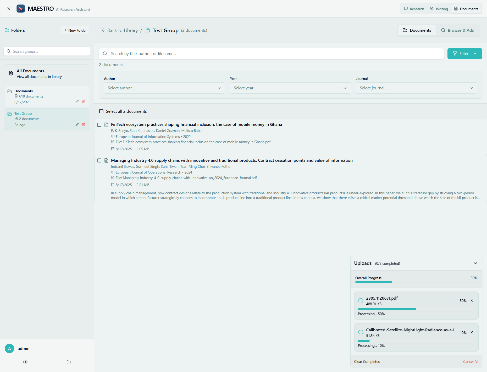

# Uploading Documents

MAESTRO provides multiple ways to upload documents to your library, supporting various file formats and batch uploads. The system automatically processes documents for semantic search and research capabilities.



## Upload Methods

### Drag and Drop
The easiest way to upload documents:
1. Navigate to the **Documents** tab
2. Drag files from your file manager
3. Drop them anywhere on the document area
4. Upload begins automatically
5. Progress indicators show status

### Upload Button
For traditional file selection:
1. Click the **"Upload Documents"** button
2. Browse and select files
3. Select multiple files with Ctrl/Cmd+Click
4. Click "Open" to start upload
5. Monitor progress in the interface

### CLI Upload
For bulk uploads via command line:
```bash
./maestro-cli.sh ingest [username] [directory]
```
This method is ideal for:
- Large document collections
- Automated workflows
- Server-side uploads
- Batch processing

## Supported File Formats

### Document Formats
- **PDF** (.pdf) - Full text extraction with GPU acceleration
- **Word** (.docx, .doc) - Microsoft Word documents
- **Markdown** (.md, .markdown) - Plain text with formatting
- **Text** (.txt) - Plain text files
- **Rich Text** (.rtf) - Formatted text documents

### Format-Specific Features
- **PDF**: Extracts text, preserves structure, handles images
- **Word**: Maintains formatting, extracts embedded content
- **Markdown**: Preserves formatting syntax, code blocks
- **Text**: Direct processing, fast indexing

## Upload Process

### Pre-Upload Checks
Before uploading, the system:
1. Validates file format
2. Checks file size limits
3. Verifies user quotas
4. Detects duplicates via SHA256 hash

### During Upload
The upload process includes:
1. **Transfer**: File sent to server
2. **Validation**: Format and content checks
3. **Storage**: Save to file system
4. **Registration**: Create database record
5. **Queue**: Add to processing pipeline

### Processing Pipeline
After upload, documents undergo:
1. **Conversion**: Transform to markdown
2. **Metadata Extraction**: Title, authors, abstract
3. **Chunking**: Split into semantic segments
4. **Embedding**: Generate vector representations
5. **Indexing**: Add to search database

## Upload Interface

### Progress Indicators
Each uploading file shows:
- **File name** and size
- **Progress bar** with percentage
- **Upload speed** (MB/s)
- **Time remaining** estimate
- **Status messages**

### Status States
Documents progress through states:
- **Uploading**: File transfer in progress
- **Queued**: Waiting for processing
- **Processing**: Being analyzed
- **Completed**: Ready for use
- **Failed**: Error occurred (with details)

## Batch Uploads

### Selecting Multiple Files
- **Desktop**: Ctrl/Cmd+Click to select multiple
- **Shift+Click**: Select range of files
- **Ctrl/Cmd+A**: Select all in folder
- **Drag multiple**: Select and drag group

### Performance Considerations
For batch uploads:
- **Recommended**: 10-50 files at once
- **Maximum**: 100 files per batch
- **Large batches**: Use CLI for 100+ files
- **Processing time**: Varies by file size and type

## File Size Limits

### Standard Limits
- **Single file**: Maximum 50MB
- **Batch total**: 500MB per upload session
- **Storage quota**: Based on user plan
- **Processing limit**: 10 concurrent files

### Large File Handling
For files over 50MB:
1. Consider splitting large PDFs
2. Compress files before upload
3. Use CLI for better control
4. Contact admin for quota increase

## Duplicate Detection

### Content Deduplication
The system prevents duplicates via:
- **SHA256 hashing** of file content
- **Automatic detection** during upload
- **User notification** of duplicates
- **Option to rename** or skip

### Handling Duplicates
When duplicate detected:
1. System shows existing document
2. Options presented:
   - Skip upload
   - Upload with new name
   - Replace existing (if owner)
3. Maintains single copy in storage

## Metadata Extraction

### Automatic Extraction
The system extracts:
- **Title**: From document metadata or content
- **Authors**: Author information if available
- **Year**: Publication or creation year
- **Abstract**: Summary or first paragraphs
- **Keywords**: Key terms and topics

### AI-Enhanced Extraction
Using LLM models to:
- Identify missing metadata
- Generate descriptive titles
- Extract key concepts
- Summarize content
- Identify document type

## Processing Status

### Monitoring Progress
Track document processing:
- **Document list**: Shows current status
- **Processing badge**: Indicates active processing
- **Completion time**: Estimated remaining time
- **Error messages**: If processing fails

### Processing Stages
1. **Stage 1**: File validation and storage
2. **Stage 2**: Content extraction
3. **Stage 3**: Metadata generation
4. **Stage 4**: Chunking and embedding
5. **Stage 5**: Index optimization

## Error Handling

### Common Upload Errors
- **Unsupported format**: File type not recognized
- **File too large**: Exceeds size limit
- **Quota exceeded**: Storage limit reached
- **Network error**: Connection interrupted
- **Duplicate file**: Content already exists

### Error Recovery
When errors occur:
1. **Automatic retry**: For network issues
2. **Error details**: Specific problem description
3. **Suggested actions**: How to resolve
4. **Manual retry**: Option to try again
5. **Support contact**: For persistent issues

## Best Practices

### Before Uploading
1. **Check file formats**: Ensure supported types
2. **Review file sizes**: Stay within limits
3. **Remove duplicates**: Clean collection first
4. **Organize files**: Group related documents
5. **Check quotas**: Verify available space

### Optimizing Uploads
1. **Batch similar files**: Group by type
2. **Off-peak hours**: Upload during low usage
3. **Stable connection**: Ensure reliable network
4. **Clean PDFs**: Remove unnecessary pages
5. **Meaningful names**: Use descriptive filenames

### Quality Control
1. **Verify processing**: Check completed status
2. **Test search**: Ensure documents searchable
3. **Review metadata**: Correct if needed
4. **Check content**: Verify extraction quality
5. **Report issues**: Note processing problems

## Advanced Features

### Custom Metadata
Add custom metadata:
- Edit after upload
- Add tags and categories
- Set document relationships
- Define access permissions
- Add notes and descriptions

### Processing Priority
Influence processing order:
- **High priority**: Critical documents
- **Standard**: Normal processing
- **Low priority**: Background processing
- **Scheduled**: Process at specific time

### Upload Automation
Automate uploads via:
- **Watch folders**: Auto-upload new files
- **API integration**: Programmatic uploads
- **Scheduled imports**: Regular updates
- **Email attachment**: Forward documents

## Performance Tips

### Upload Speed
Improve upload performance:
- **Wired connection**: Faster than WiFi
- **Modern browser**: Chrome, Firefox, Edge
- **Close other tabs**: Free up resources
- **Disable extensions**: Reduce conflicts
- **Clear cache**: If experiencing issues

### Processing Speed
Factors affecting processing:
- **File complexity**: Simple documents process faster
- **System load**: Number of concurrent users
- **Document length**: Shorter documents faster
- **GPU availability**: Significantly faster with GPU
- **Queue position**: First-in, first-out processing

## Troubleshooting

### Upload Stuck
If upload appears frozen:
1. Check network connection
2. Refresh page (upload may resume)
3. Clear browser cache
4. Try different browser
5. Use CLI as alternative

### Processing Stuck
If document stuck in processing:
1. Wait at least 15 minutes
2. Check system status
3. Contact administrator
4. Document may need manual intervention
5. Can delete and re-upload if needed

### Missing Documents
If uploaded documents don't appear:
1. Check filters and search
2. Verify upload completed
3. Check processing status
4. Look in all document groups
5. Check user permissions

## Next Steps

- [Document Library](document-library.md) - Managing your documents
- [Document Groups](document-groups.md) - Organizing collections
- [Search](overview.md#search) - Finding documents
- [Supported Formats](uploading.md#supported-formats) - Format details

## Supported Formats

MAESTRO supports the following document formats:

- **PDF** (.pdf) - Portable Document Format
- **Microsoft Word** (.docx, .doc) - Word documents
- **Markdown** (.md, .markdown) - Markdown files
- **Plain Text** (.txt) - Plain text files
- **Rich Text Format** (.rtf) - RTF documents

Documents are automatically processed and indexed for searching after upload.
