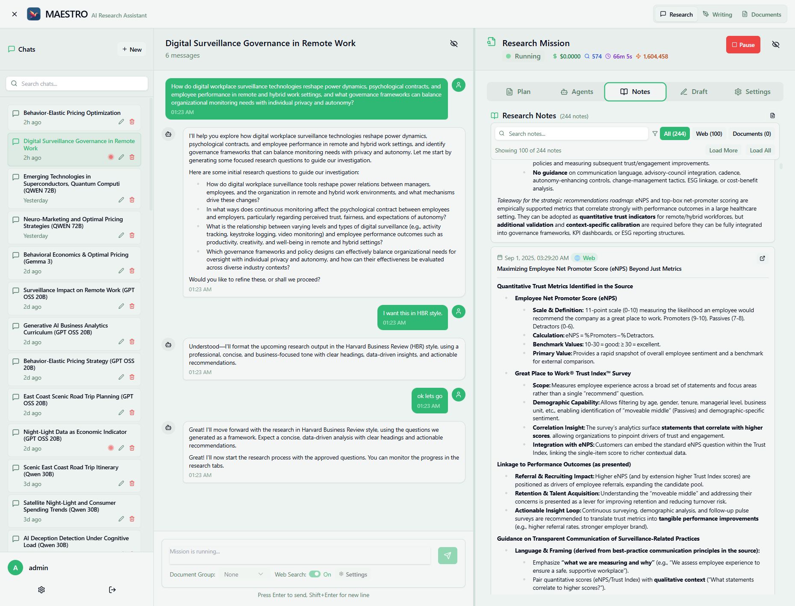
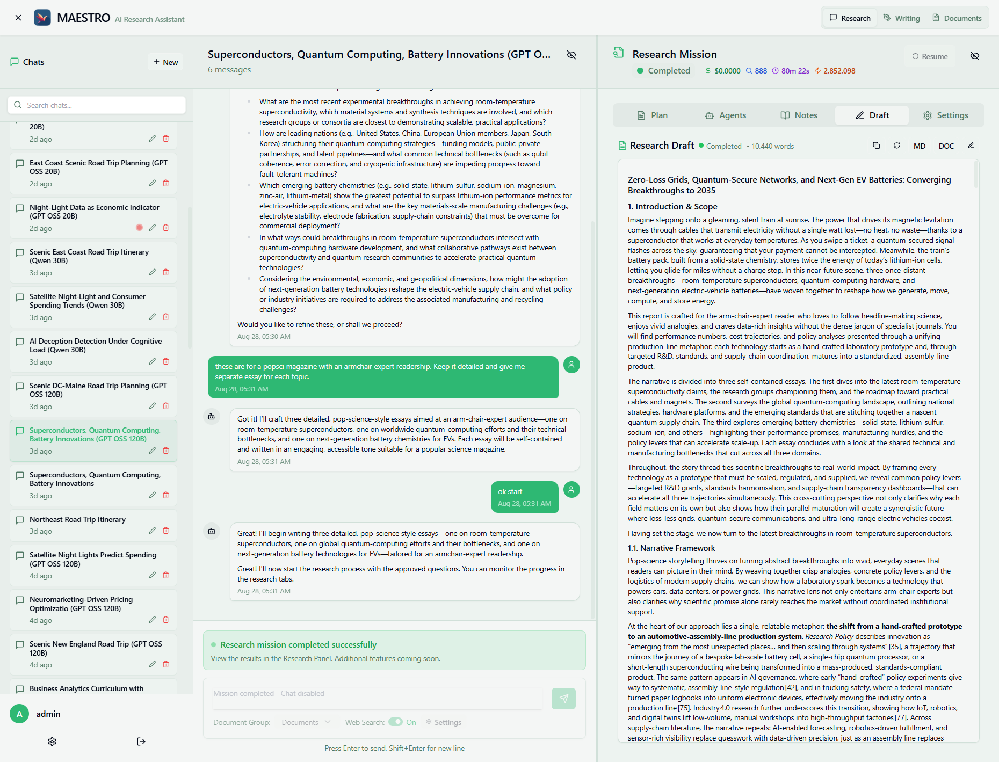
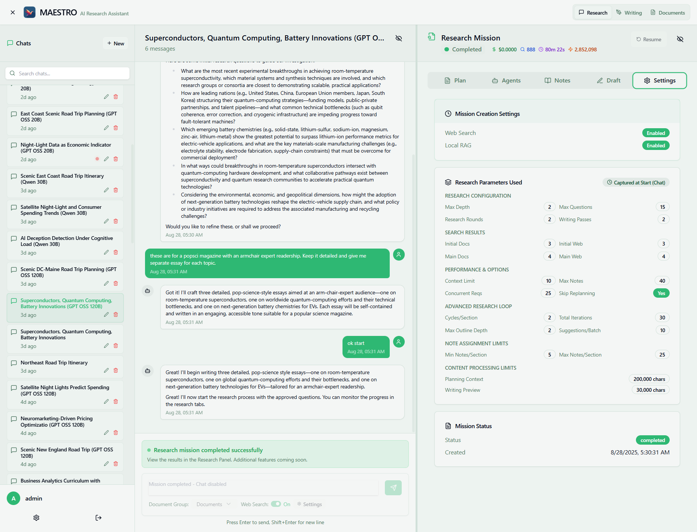

# Research with MAESTRO

MAESTRO's research system uses an agentic framework to gather information from web sources and your documents, creating comprehensive research reports through intelligent analysis and synthesis.

## How Research Works

### The Research Flow

1. **Initial Chat Phase** - You interact with the Messenger Agent to:

    - Define your research topic and requirements
    - Specify preferences (tone, format, length, audience)
    - Review and refine initial research questions
    - Add goals and constraints to the research plan

2. **Research Mission Execution** - Once started:

    - Chat becomes disabled during active research
    - Multiple specialized agents work autonomously
    - Progress tracked through real-time tabs
    - Notes generated and organized by topic

3. **Report Generation** - Upon completion:

    - Draft created from collected notes
    - Comprehensive report with citations
    - Downloadable in multiple formats

## Starting a Research Session


### Step 1: Initial Conversation

Begin by chatting with MAESTRO about your research needs. The Messenger Agent will:

- Help clarify your research objectives
- Generate initial exploration questions
- Capture your specific requirements

**Example interactions:**
```
"I need to research the psychological factors behind innovation adoption"
"Please focus on academic literature and use a formal tone"
"The report should be 3000-5000 words for a business audience"
```

### Step 2: Setting Research Parameters

During the chat, you can specify:

- **Tone**: Academic, professional, conversational
- **Output Format**: Report structure and organization
- **Length**: Word count expectations
- **Target Audience**: Technical level and background
- **Preferred Sources**: Web, documents, or both
- **Focus Areas**: Specific aspects to emphasize

The agent adds these as goals to the research plan.

### Step 3: Reviewing Initial Questions

The system generates initial research questions based on your topic. You can:

- Review the proposed questions
- Request modifications or additions
- Remove irrelevant questions
- Approve when satisfied

### Step 4: Starting the Mission

Two ways to begin:

- Type "start research" or similar command
- Click the **Start** button (top right)

Once started, the chat interface is disabled and research begins.

## Monitoring Research Progress


### The Mission Panel Tabs

During research, monitor progress through four main tabs:

#### 1. Plan Tab


Shows the research outline with sections and subsections:

- **Outline View**: Hierarchical structure
- **Goal Pad**: Research objectives and constraints
- **Scratchpad**: Agent working notes
- **Thought Pad**: Strategic planning notes

#### 2. Agents Tab

Real-time activity monitoring:

- **Activity Log**: Chronological agent actions
- **Agent Status**: Current agent activities
- **Statistics**: Performance metrics
    - Total cost
    - Token usage
    - Duration
    - Success rate

Each agent entry shows:

- Agent type (ResearchAgent, PlanningAgent, etc.)
- Current action
- Cost and token consumption
- Timestamp

#### 3. Notes Tab



Collected research findings:

- **Research Notes**: Count of notes generated
- **Organization**: Notes generated from web or documents
- **Note Details**: Each note includes:
    - Content summary
    - Source citations
    - Section assignment

Filter and search capabilities:

- By keyword
- By source type

#### 4. Draft Tab



Final report generation:

- **Live Preview**: Report as it's being written
- **Word Count**: Real-time tracking
- **Version History**: Track multiple report versions (completed missions)
- **Export Options**:
    - Markdown (.md)
    - Word document (.docx)
- **Edit Capability**: Make final adjustments
- **Continue Writing**: Seamlessly transition to writing workspace

## Research Phases Explained

### Phase 1: Initial Research

- **Duration**: 5-15 minutes
- **Activities**:
    - Exploring initial questions
    - Gathering background information
    - Identifying key themes
    - Building knowledge base

### Phase 2: Research Planning

- **Duration**: 2-5 minutes
- **Activities**:
    - Creating detailed outline
    - Identifying research gaps
    - Planning investigation strategy
    - Allocating resources

### Phase 3: Structured Research

- **Duration**: 10-30 minutes
- **Activities**:
    - Deep diving into sections
    - Gathering specific evidence
    - Cross-referencing sources
    - Building comprehensive notes

### Phase 4: Writing

- **Duration**: 5-15 minutes
- **Activities**:
    - Synthesizing notes
    - Creating coherent narrative
    - Adding citations
    - Finalizing report

## Mission Controls

### During Research

**Pause Button**: Temporarily halt research

- Preserves current progress
- Can resume later

### After Completion

**Continue to Writing**: Transition your research to the writing workspace

- Automatically transfers your research draft
- Preserves document group associations (if Auto-save docs was enabled)

**Revise/Restart**: Re-run with improved outline

- Provide feedback to modify research direction
- Skip initial exploration phase on restart

## Auto-Creating Document Groups

When conducting research that discovers valuable web sources, MAESTRO can automatically create and populate document groups with these materials. This feature preserves your research sources for future reference and enables deeper analysis through the RAG pipeline.

### How It Works

When auto-create is enabled, MAESTRO will:

1. Track all web sources discovered during research
2. Convert relevant web pages into markdown documents
3. Create a new document group named after your research topic
4. Process and index documents for semantic search
5. Associate the group with your mission for easy access

### Enabling Auto-Create

The auto-create toggle appears in the chat interface when starting a research mission. When enabled, discovered web sources are automatically saved and processed. The created document group becomes available for:

- Future research missions
- Document library browsing
- Writing assistant context
- Cross-reference searches

### Benefits

This feature eliminates manual document collection while building a knowledge base from your research activities. Each research mission can contribute to your growing document library, making subsequent research more comprehensive and efficient.

## Research Configuration



Research missions can be configured through the Settings tab or customized per mission. For a complete reference of all parameters, see the [Research Parameters Reference](parameters.md).

### Source Selection

Configure in Settings or per mission:

**Web Search**:

- Enable/disable web searching
- Configure search providers (Tavily, Jina, etc.)
- Set result limits

**Local RAG** (Document Search):

- Enable/disable document searching
- Select document groups
- Auto-create document groups from web sources

### Performance Settings

Adjust for speed vs. thoroughness:

**Research Depth**:

- Number of research rounds (how many rounds to expore the topic and revise the report structure based on collected notes)
- Number of cycles per section (will gether material for a section, reflect on whats missing and can be improved, and go for another round of research)

**Search Results**:

How many results to examine per search query

- Initial exploration: 3-10 per source
- Main research: 5-20 per query

**Concurrent Requests**:

- Higher = faster but more expensive
- Lower = slower but more economical

### Advanced Settings

**Max Outline Depth**: Hierarchy levels (1-4)
**Cycles/Section**: Research iterations per section (1-3)
**Notes/Section**: Information density (5-40)
**Content Limits**: Maximum characters for various components to help break large context up for resource constrained local LLMs

**For detailed parameter documentation, see [Research Parameters Reference](parameters.md)**

## Understanding the Statistics

### Cost Tracking
- **Total Cost**: Cumulative API expenses
- **Per Agent**: Individual agent costs
- **Token Usage**: Input/output tokens

### Performance Metrics
- **Duration**: Time for API calls
- **Success Rate**: Query success percentage
- **Tool Calls**: Number of searches/retrievals
- **File Interactions**: Documents accessed

### Research Phases Chart

Visual breakdown showing:

- Initial Research (percentage)
- Structured Research (percentage)
- Writing (percentage)

## Tips for Better Results

### Clear Instructions

- Be specific about your needs
- Provide context and background
- State constraints upfront

### Source Management

- Upload relevant documents before starting
- Create focused document groups
- Remove outdated materials

### Optimal Settings

- Start with defaults or one of the presets
- Increase depth for complex topics
- Balance speed vs. thoroughness

## Common Issues and Solutions

### Mission Won't Start

- Verify AI provider configured
- Check API credits available
- Ensure at least one source enabled

### Slow Progress

- Reduce concurrent requests
- Use faster AI models
- Limit search results

### Incomplete Results

- Increase research depth
- Add more rounds

### High Costs

- Use economical models for research
- Reduce search results
- Limit research rounds/cycles

## Next Steps

1. **Configure AI Providers** - Set up your language models in [Settings](../settings/ai-config.md)
2. **Upload Documents** - Build your research library in [Documents](../documents/overview.md)
3. **Start Researching** - Begin with a simple topic to learn the interface
4. **Optimize Settings** - Adjust parameters based on your needs

For additional help, see the [FAQ](../../troubleshooting/faq.md) or visit our [Community Forum](https://github.com/murtaza-nasir/maestro/discussions).