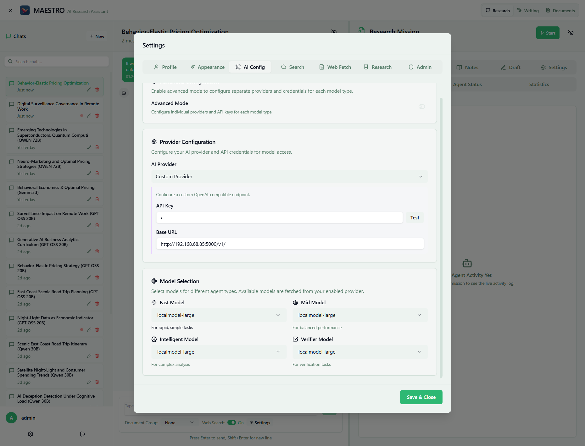

# AI Configuration

Configure language model providers to power MAESTRO's research and writing capabilities.

For complete details on AI provider configuration, see the comprehensive [AI Provider Configuration Guide](../../getting-started/configuration/ai-providers.md).

## Quick Overview

MAESTRO supports multiple AI providers through a unified interface:

- **OpenRouter** - Access to 100+ models via unified API
- **OpenAI** - Direct access to GPT models  
- **Custom Provider** - Any OpenAI-compatible endpoint (local LLMs, enterprise endpoints)

## Model Types Used by MAESTRO

MAESTRO automatically assigns different model types to various agents:

### Fast Model
Used by: Planning Agent, Note Assignment, Query Strategy, Router

- Quick decisions and simple formatting

### Mid Model (Default)
Used by: Research Agent, Writing Agent, Messenger Agent

- General research and writing tasks

### Intelligent Model
Used by: Reflection Agent, Query Preparation, Critical Analysis

- Complex reasoning and quality assessment

### Verifier Model
Used by: Fact-checking and validation tasks

- Ensuring accuracy of information

## Configuration Steps

1. **Navigate to Settings** → AI Config tab
2. **Enable Advanced Configuration** checkbox for per-model settings
3. **For each model type**:
      - Select "Custom Provider"
      - Enter API key (if required)
      - Enter base URL
      - Click "Test" to verify connection
      - Select model from dropdown
4. **Save & Close** to apply settings

## Common Endpoints

- **OpenRouter**: `https://openrouter.ai/api/v1/`
- **OpenAI**: `https://api.openai.com/v1/`
- **Local Ollama**: `http://host.docker.internal:11434/v1/` (or check your ollama config)
- **Local vLLM**: `http://host.docker.internal:8000/v1/` (or check your vllm config)

## Related Documentation

- [Complete AI Provider Guide](../../getting-started/configuration/ai-providers.md) - Detailed setup instructions
- [Search Configuration](search-config.md) - Configure web search providers
- [Research Configuration](research-config.md) - Optimize research parameters