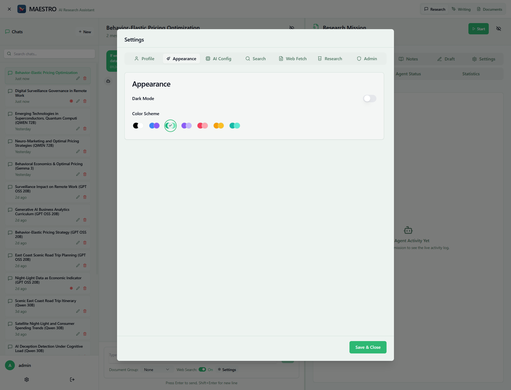

# Appearance Settings

Customize MAESTRO's visual appearance to suit your preferences.

## Dark Mode

Toggle between light and dark themes for comfortable viewing.

- **Light Mode** - Best for bright environments and daytime work
- **Dark Mode** - Reduces eye strain in low-light conditions

## Color Scheme

Choose from six accent colors to personalize your interface:

- **Blue** (Default) - Professional, universally accessible
- **Green** - Calming, nature-inspired
- **Purple** - Creative, modern
- **Red** - High contrast, attention-focused
- **Orange** - Warm, energetic
- **Teal** - Cool, balanced

Click any color circle to apply instantly. Your selection affects buttons, links, highlights, and progress indicators.

## Settings Behavior

- **Account-based** - Preferences sync across devices

## Troubleshooting

- **Theme not changing**: Refresh browser (Ctrl+F5)
- **Colors not applying**: Click directly on color circle

## Next Steps

- [AI Configuration](ai-config.md) - Configure language models
- [Search Settings](search-config.md) - Set up web search
- [Research Settings](research-config.md) - Configure missions