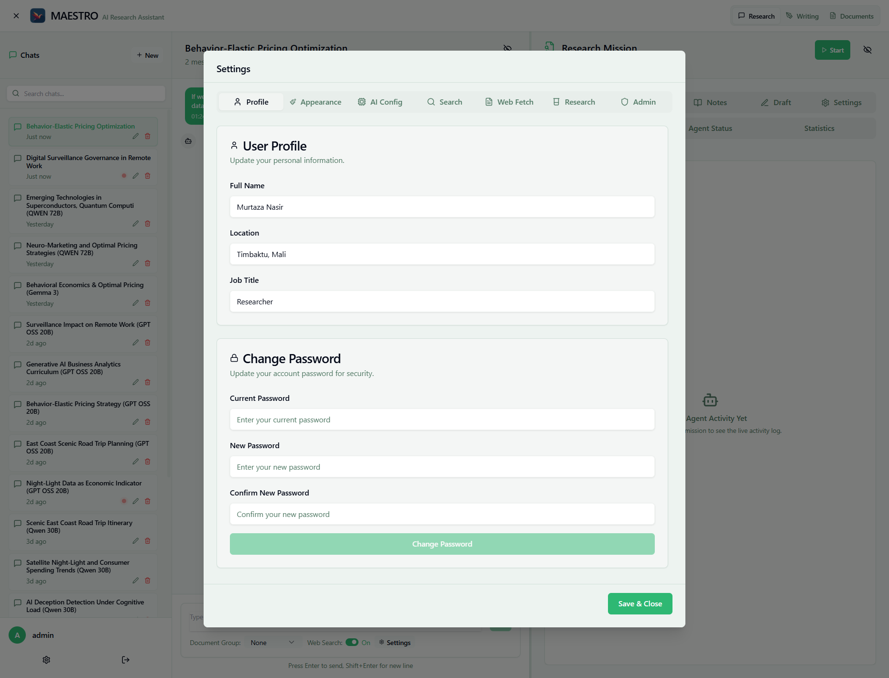

# Profile Settings

Manage your personal information and account security.

## User Profile

Update your personal information that appears throughout MAESTRO.

### Available Fields

- **Full Name** - Display name in documents and missions
- **Location** - Geographic location (optional)
- **Job Title** - Professional role

## Change Password

### Requirements
- Minimum 6 characters
- Current password required for verification

### Steps
1. Enter current password
2. Enter new password (6+ characters)
3. Confirm new password
4. Click "Change Password"

## Common Issues

- **Password change fails**: Verify current password is correct
- **Changes not saving**: Click "Save & Close" in main dialog

## Next Steps

- [AI Configuration](ai-config.md) - Configure language models
- [Search Settings](search-config.md) - Set up web search
- [Research Settings](research-config.md) - Configure missions