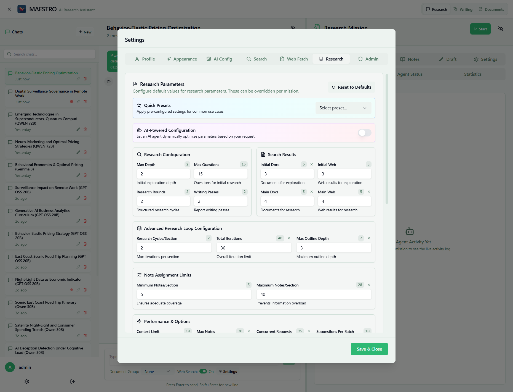

# Research Configuration

Configure default parameters for research missions to control how MAESTRO's agents plan, execute, and synthesize research tasks.

## Overview

Research configuration allows you to fine-tune over 30 parameters that control the depth, breadth, and quality of research missions.

## Quick Setup

1. **Navigate to Settings → Research**
2. **Choose a preset** or enable AI-powered configuration
3. **Adjust parameters** as needed (optional)
4. **Click "Save & Close"**

## Configuration Options

### Presets

- **Quick & Simple** - Fast, minimal depth for quick questions
- **Balanced** - Default settings for most research tasks
- **Deep Analysis** - Maximum depth for complex topics
- **Academic Paper** - Literature review focused
- **Current Events** - Web-focused for recent information
- **Custom** - Manual configuration

### AI-Powered Configuration

Enable automatic parameter optimization based on your research query. The AI agent analyzes your request and adjusts settings dynamically.

## Key Parameters

### Essential Settings
- **Research Rounds** - Number of structured research cycles
- **Max Questions** - Questions generated for initial research
- **Writing Passes** - Report refinement iterations

### Search Configuration
- **Document Results** - Documents retrieved per search
- **Web Results** - Web pages retrieved per search
- **Search Depth** - Initial exploration depth

### Performance Settings
- **Concurrent Requests** - Parallel operations (min 10)
- **Context Limits** - Memory usage controls
- **Max Notes** - Information retained after filtering

## Comprehensive Parameter Reference

For detailed documentation of all 30+ research parameters including:

- Complete parameter descriptions
- Default values and ranges
- Use cases and recommendations
- Performance impact analysis

See the [Research Parameters Reference](../research/parameters.md).

## Usage Tips

### Choosing the Right Configuration

| Research Type | Recommended Setting | Key Adjustments |
|--------------|-------------------|-----------------|
| Quick Facts | Quick & Simple | Low rounds, minimal depth |
| General Research | Balanced | Default settings |
| Academic Review | Academic Paper | High document focus |
| Current News | Current Events | Web-focused, recent data |
| Complex Analysis | Deep Analysis | Maximum iterations |

### Performance Optimization

- **For Speed**: Reduce rounds, questions, and iterations
- **For Quality**: Increase writing passes and research rounds
- **For Coverage**: Increase max questions and search results
- **For Memory**: Adjust context limits and max notes

## Common Issues

- **Slow research**: Reduce concurrent requests or iteration limits
- **Insufficient depth**: Increase research rounds and max questions
- **Memory errors**: Lower context limits and max notes
- **Missing information**: Increase search results and rounds

## Next Steps

- [Research Parameters Reference](../research/parameters.md) - Complete parameter documentation
- [AI Configuration](ai-config.md) - Configure language models
- [Search Configuration](search-config.md) - Set up web search providers
- [Research Overview](../research/overview.md) - Learn about research workflow